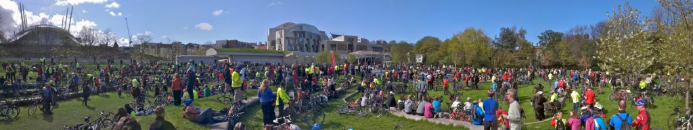
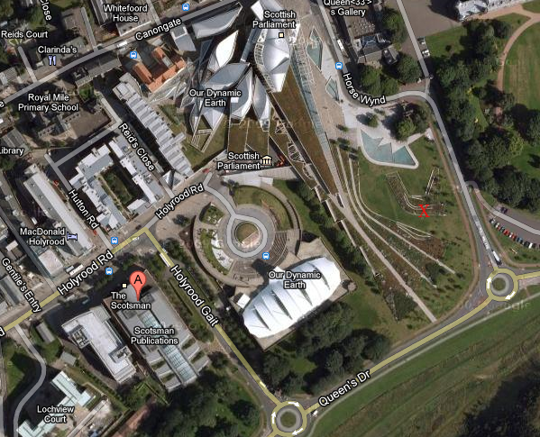

Yesterday we all got on our bikes to [Pedal on Parliament](http://pedalonparliament.org/) and protest at the disproportionate cuts to the active travel budgets. Basically everyone admits that Scotland would be a better place if we built our roads so that it was safer to cycle but it is very difficult to get it prioritised over creating more motorist centric facilities. The rally also remembered those who have been killed on our roads - including two cyclists in Edinburgh this year already. Lets hope that no one we know is the third.

I was rather dreading that there would be a handful of us and it would rain but the sun shone and there was a massive turnout. Around 2,000 cyclists as confirmed by the police.<!--more--> Now it is Sunday morning and I turn to the web to see what coverage there is in the press. Lets look at Scotland on Sunday, The Scotsman and Edinburgh Evening News on-line. To get some perspective here is a snapshot taken from Google Maps.

The 'A' marker is the location of the whiz-bang high tech Scotsman Publications offices. The 'X' marker is where the photo at the head of the page was taken. I guess that is less than 300 yards away. The action took place at 3pm on Saturday 29th April. As I write the Scotsman has [an article of some 294 words](http://www.scotsman.com/news/brown-backs-cycle-group-campaign-1-2261742) that was written at 10:58am! Yes that is right in the morning before it happens. I guess the journalist then went home and they don't have anyone working on a Saturday afternoon. So why should I pay for a physical version of this paper? Of course there may be more coverage on Monday in the Scotsman and the Edinburgh Evening news. It was certainly a good photo opp for a local paper but this is hardly hot news gathering is it. They manage to cover football matches so they could cover demo's if they wanted. I suspect there were journalist working in that building and they litterally didn't look out the window but just carried on cutting and pasting things off the web.

The arch rival to the Scotsman is the Glasgow Herald. Their coverage this morning amounts to [a 92 word article](http://www.heraldscotland.com/news/home-news/pedallers-make-plea.17440224) on their website. Great coverage of life in Scotland! Maybe we would have got more if we had blocked Sauchiehall Street in Glasgow.

The English press? Guardian/Observer => nothing. The Telegraph has [a whole 654 word article under cycling](http://www.telegraph.co.uk/sport/othersports/cycling/9234191/Tour-of-Romandy-2012-Bradley-Wiggins-well-placed-to-claim-victory-despite-losing-yellow-jersey.html) but it is about Bradly Wiggins in the Tour Romandy. That is 'Sport' and safely foreign and so can be covered with a dedicated journalist. No coverage of real people cycling - that would be far to left wing for the Telegraph!

The Times has a [Citites Fit For Cycling Campaign](http://www.thetimes.co.uk/tto/public/cyclesafety/article3306950.ece) - well done - and they cover the 10,000 cyclists ride out in London and by accident give better coverage to the Edinburgh event than anyone in Scotland. It is actually reporting an event that I was at. Why does it take a newspaper based 400 miles away to cover events in the Scottish capital?

The Times article claims 10,000 cyclists in London and 3,000 in Edinburgh. Considering Edinburgh has a population of less than half a million and Scotland only 5.2 million compared with 7.8 million in greater London alone and far more in easy reach of the capital I can't help feeling this shows stronger feeling on these matters in the Scottish population than in London - so why don't the Scottish press reflect this? Oh - they just cover the footie on Saturdays!

Of course the BBC had [an article on their website](http://www.bbc.co.uk/news/uk-scotland-edinburgh-east-fife-17880541).

My point is the Scottish press appear to be a somewhat part time, waste of space when it comes to reporting things even on their own doorstep unless it is football.

(p.s. You can click to zoom in on the panorama at the top or the page - taken with my HTC One X phone)

Update: Apparently the physical Scotland on Sunday does have [a picture but not much else](https://twitter.com/#!/andrewcyclist/status/196536828042559488/photo/1).

Update: Nice tweet from @POPScotland "The Police told us #POP28 Was the **biggest protest rally to have been staged outside the Scottish Parliament** & the friendliest!"
