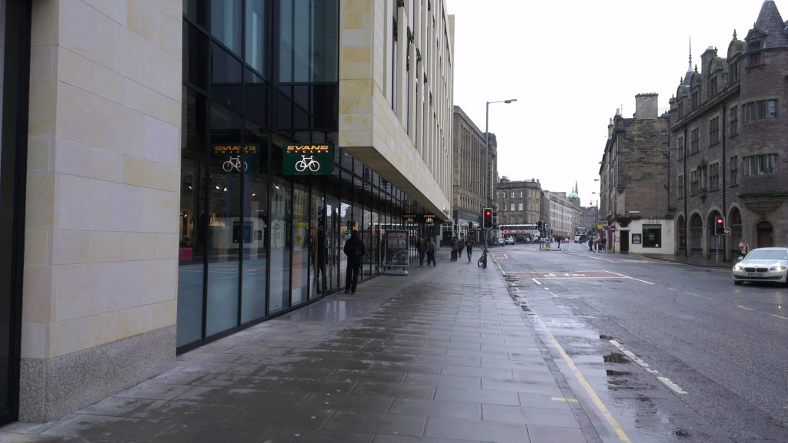
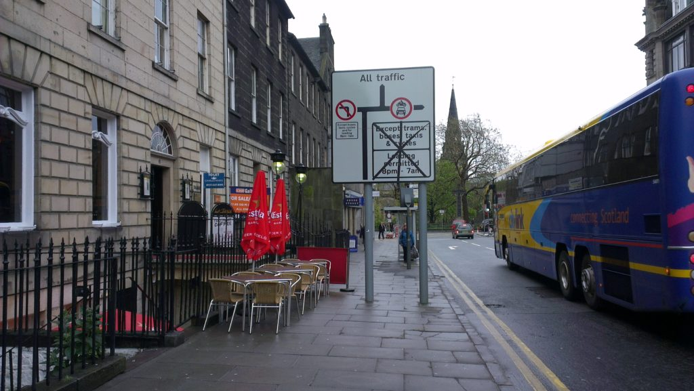

If more people cycled then the city would flow more freely, people would be fitter and life would be better. Generally you would think that it would be in the council's interest to favour anything that promoted cycling that didn't cost anything or get in anyone else's  way. But then you would be hopelessly naive to believe that.

One of my bugbears is that they continually try to shove cycle parking out of sight into some dark corner where it won't offend anyone. The police, and any sane cyclist, will tell you to lock your bike up in full public view to prevent anyone nicking it. Women (and many men) are nervous to go round the corner of a building into a dark alley at night. The whole point of cycling is that you can get really close to the place you are going before you have to get off the thing and walk. If we are going to have to walk a few hundred yards at the end of a journey then maybe we won't bother going and the traders at the end of our intended route won't get our money.

The simple conclusion is to put cycle parking in front of buildings or even in central reservations of the road system.

So where do Edinburgh City Council tend to put cycle parking? Round a dark corner of course.

This week a big new cycle shop has opened in town - [Evans in Edinburgh](http://www.evanscycles.com/stores/edinburgh). In my lunch hour I nipped up town to take a look. Here is a picture of the outside of the shop.

Can you see what is missing? This shop runs nearly the full length of the block. There is nowhere to lock your bike. You have to go around the corner to some rubbish little designer stand next to the dodgy blokes having a fag - somewhere I try to train my daughters not to go.

I asked in the shop and apparently they wanted to put a cycle rack up but **the council wouldn't let them**. Make our town better for free? No the council won't let you.

Now take a look at this photo.

Can you see what is missing? The pavement! This is a far narrower pavement probably on a busier road outside listed buildings. Someone with a visual impairment would find this a 'challenge'. Half this stuff has been put up by the council. So why is this business permitted to clutter up the pavement and the council prepared to block it with their own signs yet Evans can't even put up a bike rack? Possibly because this business is selling alcohol to tourists and that is about as far as the council's vision of building a vibrant city goes.

Come on council - get your act together and do the things that cost nothing but make our city better.
