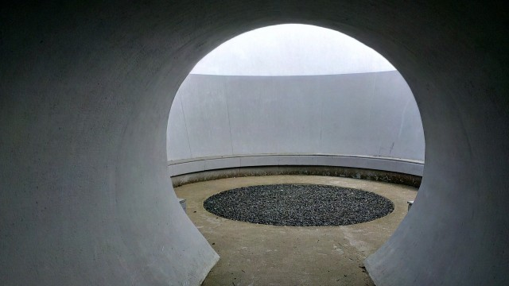

I just finished reading [Claudia Hammond](http://www.claudiahammond.com/)'s latest book "[Time Warped](http://www.amazon.co.uk/Time-Warped-Claudia-Hammond/dp/1847677908)". Claudia is a psychologist who presents programmes on health (particularly mental health) on  BBC Radio 4 and BBC World Service. Chief amongst these is [All in the Mind](http://www.bbc.co.uk/programmes/b006qxx9) and my favourite [Mind Changers](http://www.bbc.co.uk/programmes/b008cy1j).

Time Warped is a fun read. I start quite a few popular science books but don't always finish them often because the style becomes laboured as the author tries to force human interest into every piece of research they mention - I find myself saying "too many words". Time Warped does **not** fall into this category. There was plenty of stuff that is new to me and made me think more about my perception of time and how I related to it. I'd never heard the one about moving Wednesday's meeting two days "forward"  - does it fall on Monday or Friday (definitely Friday for me).

I recommend the book as a good read ... however...  I do think Claudia drops the ball when she mentions mindfulness and I have been wondering what to do about it. I don't want to critise what is a good book but I do want to set the record straight - so I thought I'd write this as a kind of addendum - but then I realised I had already more or less written it back in 2010 in the post "[The Present Moment Does Not Exit](http://www.hyam.net/blog/archives/747 "The Present Moment Does Not Exit")"! In that post I hope I establish that we can choose how we interpret the "Here and Now" i.e. what we consider to be part of our current experience and what we don't. Because we have this choice we can actually control how we perceive not just time but everything. If you don't have an active contemplative practice this may be a hard pill to swallow and I think this is where Claudia misses it.<!--more-->She gives us the classic quote:

> Like many students I had a go at learning to meditate.

This is a variation on the one I have often used to raise a laugh with fellow meditators "I tried meditating once but I couldn't do it." If you don't have a meditation practice it takes some explaining as to why this is so funny. It is kind of like "I had a go at learning the violin but couldn't do it" but that is still wide of the mark. Meditation is not a skill. It is not something to be acquired. I have been sitting for nearly twenty years and I don't feel there is anything I can "do". Sure I can sit still for forty minutes and I feel that the practice enriches my life but it isn't something I feel I can do - like driving a car or walking in a straight line.

I think this notion of mindfulness as a skill comes from some of the training techniques taught in the Mindfulness Based Stress Reduction and similar courses. There are definite skills to acquired with regard to engaging with the practice. How do we learn to turn the TV off and just sit for a few minutes? How to we disengage from stressful situations we are only making worse and re-engage with our experience? All these types of thing are very useful and very important but they are not mindfulness. They are tools to help us get started.

> It is our ability to time-travel mentally that gives us the experience of mental reality. It roots us.

This is the reverse of what is realised through mindfulness practice. We have a current experience that lacks a narrative. If we can be accepting of this current experience it roots us and we feel a great release from the need for things to be otherwise. If we get too caught up in narratives about the future and the past and treat them as too 'real' rather than constructs of our mind then it literally make us ill.  Our ability to time-travel is actually the root of most affective disorders (depression, anxiety etc) as well as being useful for planning and learning. Our ability to choose not to time-travel is the cure.

> The idea is that you learn the ability to focus your mind whenever you choose to. You will want to select your moment carefully. If you're taking a gondola trip through Venice, the last thing you want to do is focus on your breathing and how your body is feeling. But at other moments it can make you feel much calmer and stop thoughts from the past and future from crashing in on what you are doing.

Again this is missing the point. Focusing on your breathing and how your body is feeling is something you do to help develop mindfulness. It is not mindfulness in itself. An analogy would be that you might go jogging to keep fit so you can play tennis better. That doesn't mean you wouldn't jog around the court to warm up or even during the match to stay warm. A dramatic sensory experience is an ideal time to make sure you are in the present moment to experience it fully. So bringing your attention to your breathing and body as you sit in that gondola is probably a good idea. When I have been in meetings on scientific or administrative matters with other meditators we have usually started with a period of sitting to make sure we are all actually present.

The subversive side of this is that once you get used to it you find that every moment is pretty wonderful. You don't have to go on gondola trips to have a good time you can just sit on a bus in the rain or stand in a Post Office queue. Each moment is complete. This is liberation.

I think Claudia has, to use a Zen cliche, confused the finger pointing to the moon with the moon when it comes to mindfulness. That's fine because the book isn't about mindfulness but it worries me slightly because I see it so often all over the place. People think they "get it" when there is no "thing" to get. There is just this. The suchness of the lived experience outside of time.
