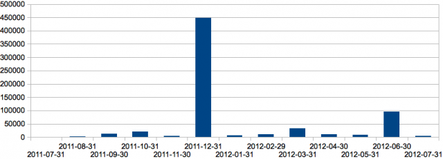
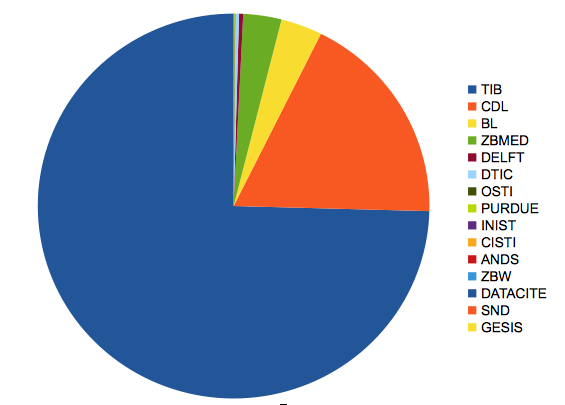

I have been seeing [DataCite.org](http://www.datacite.org/) mentioned quite a lot so I thought I'd take a look at what they were up to. They have an [OAI-PMH](http://www.openarchives.org/OAI/openarchivesprotocol.html) provider so you can simply go to the [List Records](http://oai.datacite.org/oai?verb=ListRecords&metadataPrefix=oai_dc) page and see how many records they have. Try it for yourself now. At the bottom of the page today it says that there are 654,748 records in their repository.

Then I read on the [DataCite.org](http://www.datacite.org/) home page (my emphasis):

> We think it is very important that the two **largest DOI Registration Agencies** work together in order to provide metadata services to DOI names.

This seemed an amazing claim as I had it in my head that CrossRef had 50+ million references. So if the second biggest only had just over half a million that implies there is only really one registration agency. I wonder who claims to be numbers three, four and five in the DOI Registration listings?

So I tweeted:

> DataCite 654,748 records - I think this inflated. CrossRef have 50 million. CrossRef is about 100x bigger. Who is the 3rd largest?

And [@epentz](https://twitter.com/epentz) replied:

> @rogerhyam #datacite has registered about 1.3 million DOIs, #CrossRef 54.6 million

Where did those numbers come from? Now I was curious so I went back to the DataCite.org OAI-PMH provider but this time I used a script to have a look. This is the deposition history by month for the entire registry:

The vast majority were created in December last year - a single provider I presume. Then there was another large batch in June this year.

Next I looked at the Sets in the registry. DataCite seem to create a set and then subsets for each organisation the create DOI's for. Here is the pie chart showing the number of records per organisation:

The vast majority are TIB (German National Library of Science and Technology) and CDL (California Digital Library) who have contributed about 90%. There are 15 organizations in total 11 of those have contributed less than 2,500 records each.

I have no intention of knocking the project but from looking at the DataCite.org website and reading their [promotional material](http://www.datacite.org/whatdowedo) (which talks of providing access to 'data sets') you do **not** get the impression that they are, in fact, mainly libraries providing citations to publications rather than data. The data citations I have seen do not look like the will give permanent access to data. Look at this example [doi:10.5520/SAGECITE-1](http://dx.doi.org/10.5520/SAGECITE-1) which resolves to a website on a free Google service. How long is that going to last? If  you read the [Google terms and conditions](http://www.google.com/intl/en/policies/terms/) they give no warranty and may remove the service when they like. The site is called sagecite**demo**repository. The clue is in the name. The data is hardly longer than the DOI that is used to cite it so why does it have a DOI? I'm confused. What value have DataCite.org added to this process other than indicate that something will persist that clearly is never intended to. Where is the quality control? What does it mean for a piece of data to have a DOI?

I will watch with interest to see how this develops and whether it makes the leap to linking to significant quantities of raw scientific data that is being properly curated.

Here is the code and data from my analysis - you can run it again as command line PHP scripts if you like: [datacite](datacite.zip)

Your comments and corrections are always welcome!
