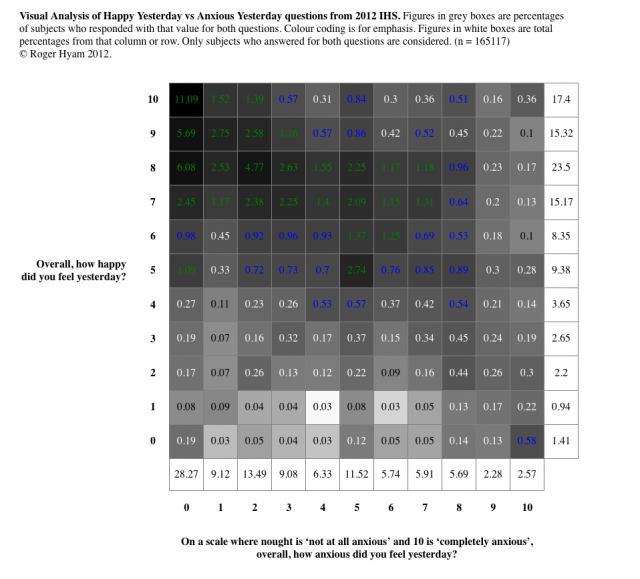
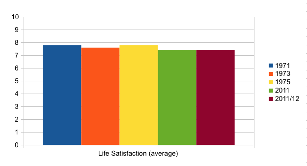

Sometimes I just can't let go of a subject even though it is outside my power to do anything about it. In these situations my blog serves as a way for me to draw a line under it and move on.

On 25th November 2010 David Cameron gave a [speech on Wellbeing at Downing Street](http://www.number10.gov.uk/news/pm-speech-on-well-being/). He was announcing the start of the [Office for National Statistics](http://www.statistics.gov.uk) (ONS) measurement of national well-being. A memorable quote from his speech is:

> Now, of course, you cannot capture happiness on a spreadsheet any more than you can bottle it.

The PM's speech wasn't the start of his interest. He had been keen on measuring well-being when he was in opposition and I admire him for pursuing it in office. From 2011 the Office for National Statistics (ONS) started to produce publications on well-being. You can access all the [ONS publications online](http://www.ons.gov.uk/ons/guide-method/user-guidance/well-being/publications/index.html) .There was a consultation and a report. By December 2011 four questions had been settled on and some pilot studies run as part of the ONS Opinions Survey. The results of the pilot are published as "[Initial investigation into Subjective Well-being data from the ONS Opinions Survey](http://www.ons.gov.uk/ons/rel/wellbeing/measuring-subjective-wellbeing-in-the-uk/investigation-of-subjective-well-being-data-from-the-ons-opinions-survey/index.html)". Around four thousand people were polled in the Opinions Survey in four separate groups. Following on from this the four questions were put to over 160,000 subjects as part of the Annual Population Survey. The results were published as "[First Annual ONS Experimental Subjective Well-being Results](http://www.ons.gov.uk/ons/rel/wellbeing/measuring-subjective-wellbeing-in-the-uk/first-annual-ons-experimental-subjective-well-being-results/first-ons-annual-experimental-subjective-well-being-results.html)" in July 2012. If you want to access the data behind these surveys it is available at the [UK Data Archive](http://www.data-archive.ac.uk/). You have to sign up and be vetted but they gave me access so they can't be that fussy.

As you can see from the list of publications these four questions are not the only thing the ONS are doing but they make up the major part of it. Reading the reports I can't put my finger on how they were derived. Reading the questions I can't believe they were asked. Looking at the results I am not surprised at all. This blog post is about why I think these are the wrong questions to be asking as part of the wrong approach to the challenge of measuring well-being.

I have spent too many evenings looking at attempts to "capture happiness on a spreadsheet".

<!--more-->

## The Four Questions

The four questions asked by the ONS are given in the table below. Please go ahead and answer them for yourself before you read any further. Many of my arguments are about the experiential nature of answering the questions and you can't know what that is unless you have actually experienced it. This data isn't being stored anywhere. I'm not doing a sneaky survey of my readers.

|  |  | 0 | 1 | 2 | 3 | 4 | 5 | 6 | 7 | 8 | 9 | 10 |
| --- | --- | --- | --- | --- | --- | --- | --- | --- | --- | --- | --- | --- |
| 1 | **Overall, how satisfied are you with your life nowadays?** (Where 0 is ‘not at all satisfied’ and 10 is ‘completely satisfied’) |  |  |  |  |  |  |  |  |  |  |  |
| 2 | **Overall, to what extent do you feel that the things you do in your life are worthwhile?** (Where 0 is ‘not at all worthwhile’ and 10 is ‘completely worthwhile’) |  |  |  |  |  |  |  |  |  |  |  |
| 3 | **Overall, how happy did you feel yesterday?** (Where 0 is ‘not at all happy’ and 10 is ‘completely happy’) |  |  |  |  |  |  |  |  |  |  |  |
| 4 | **On a scale where nought is ‘not at all anxious’ and 10 is ‘completely anxious’, overall, how anxious did you feel yesterday?** |  |  |  |  |  |  |  |  |  |  |  |

## The Results

The results of the analysis are reported differently in the Opinions Survey and the Population Survey. In the former the full eleven point scale is always present. In the latter the scale is 'chunked' into four ranges of very high (6-10), high (4-5), medium(2-3) and low (0-1). Quite why this is done I don't know. It would have been simple enough to include the full 0-10 figures as well as the ranges so that comparisons with the earlier study could be made but the authors chose not to do that. I am not particularly happy with the names for the ranges either. There is a very high but no very low which is odd as the results are skewed to the very high.

The actual results can be summarized as most people answering 7 or 8 on the first three questions and more or less 2 or 3 on the last question. I expect that is how you answered them.

The Opinions Survey gave the correlations between the scoring for the four questions. The Population Survey did not - which is a shame. This is what the Pearson's correlations look like in the first survey:

    
| Combined | Satisfied | Worthwhile | Happy | Anxious |
| :-: | :-: | :-: | :-: | :-: |
| Satisfied | 1.00 | 0.66 | 0.54 | \-0.23 |
| Worthwhile | 0.66 | #VALUE! | 0.51 | \-0.21 |
| Happy | 0.54 | 0.51 | 1.00 | \-0.35 |
| Anxious | \-0.23 | \-0.21 | \-0.35 | 1.00 |

 

This implies there is a quite strong correlation between the first three questions and a weak negative correlation with the anxiety question. The anxiety results interested me. Was it just because the scale switched from 10 being good to 0 being good and people didn't twig or was it showing something more meaningful? Would it be repeated in the larger Population Survey? I down loaded the data but I don't have the time, skills or software to produce correlation coefficients for a large complex data set like this. Instead of that I produced the plot of the Happy/Anxious questions below. Click the image for a larger version.

 

My visualization shows the clumping of the results for happy yesterday around the 7-8 mark and anxious yesterday around the 2-3 mark though I'll talk more about this chart further on.

I think the results are entirely predictable given some simple socio-psychological facts that I will discuss below but first I need to talk about the press and effect size.

## Effect Size

If you have been following this in the press you will have seen stories like "[Wellbeing index points way to bliss: live on a remote island, and don't work](http://www.guardian.co.uk/lifeandstyle/2012/jul/24/national-wellbeing-index-annual-results)" in the Guardian and more realistically "[ONS well-being report reveals UK's happiness ratings](http://www.bbc.co.uk/news/uk-politics-18966729)" on the BBC. Both these articles make use of the [mapping tool produced by the ONS](http://www.neighbourhood.statistics.gov.uk/HTMLDocs/dvc34/well-being_map.html). Unfortunately this tool uses the results chunked into a different set of ranges to the main report - so no easy comparisons there. But since we can map all these differences they must be important - right! Well maybe not.

In the last stats class I took they were very keen on stressing the use of [effect size](http://en.wikipedia.org/wiki/Effect_size). Understanding this is very easy. A weight loss programme may show statistically significant result for people who go on it. The fact that the weight loss is significant does not say what the **size** of the difference is. Some people on the programme may have lost loads, others less.  The effect size is a measure of the mean difference allowing for variability in the before and after groups. Cohen's d is probably the easiest effect size to calculate. Zero means no effect at all and two means the most effect possible. One is considered a large effect.

Going back to our four questions we can look at how the different socio-economic characteristics of the subjects (captured in other questions they were asked) map to their scores on well-being. If we changed from reporting our health as very good to very bad then it would have a big difference in how we scored our happiness. But looking at other characteristics the effect sizes are really quite small. The effect on happiness between regions is negligible. Yet this is what the Guardian use on their map - they hardly mention health!

**Cohen's d For Largest Differences Between Personal and Socio-economic Characteristics**

| Comparison | Satisfied | Worthwhile | Happy | Anxious |
| --- | --- | --- | --- | --- |
| V. Good to V. Bad Health | 0.48 (Medium) | 1.07 (Large) | 1.18 (Large) | \-0.91 (Large) |
| Married to Divorced | 0.17 (Small) | 0.37 (Small-Medium) | 0.35 (Small-Medium) | \-0.18 (Small) |
| Region to Region | 0.15 (Small) | 0.15 (Small) | 0.07 (Negligible) | \-0.15 (Small) |

**Note:** Comparisons between regions were done for the largest differences in each domain: Satisfaction (E England to N Ireland), Worthwhile (SW England to London), Happy (NE England to N Ireland) Anxious (London to SW England). Cohen's D was calculated using an [on-line calculator](http://www.uccs.edu/~lbecker/).

**Note:** This isn't implying cause and effect though. We don't know that feeling happier might not make us score our health better. People may be happy because they live in a region or may move to a region because they are happy. We can still talk about effect size though.

## Face Validity

[Face Validity](http://en.wikipedia.org/wiki/Face_validity) is the first test you put a questionnaire to before you think about sampling and statistics. You ask yourself "Does it look like it will work?". You may ask a few friends or collegues if they think it will work. I tried it over lunch. People just laughed. The best reply I got was "Don't be so stupid!" When I ask myself the questions I don't know how I would answer them either. I really don't know what it means to say the things I do are 'worthwhile' so how can I know what the statistical analysis of thousands of other people answering that question might mean? The four questions fail on face validity because it simply isn't clear what they are measuring - in a common sense way.

## Cognition and Affect

[Affect](http://en.wikipedia.org/wiki/Affect_%28psychology%29) in psychology is the feeling of experience or emotion. [Cognition](http://en.wikipedia.org/wiki/Cognition) is to do with thoughts, reasoning and language. All four ONS questions appear to be about affect. Satisfaction, a sense of worth, happiness and anxiety are all feelings. The trouble with any questionnaire is that we need to assess people's feelings and emotions via their thinking minds - via cognition. The wording of the questions invites contemplation in the cognitive sense. The key is in the word "Overall". It invites the subject to make a mental list that they may have to defend.

When you answered the questions did you find that you naturally continue with "Because...."? I am satisfied because... What I do is worthwhile because... I am sure the intention of the wording is to get the subject to include a large amount of their experience when answering the question but how do we know if it will elicit this response or even if the subject is capable of giving a reliable estimate of their life 'nowadays' or 'yesterday'? Further on I'll argue that they probably can't and what they are actually reporting is the logical (cognitive) response to the situation they are put in - that it has very little to do with how they feel over time.

Daniel Kahneman gave a wonderful TED talk on the "[The riddle of experience vs. memory](http://www.ted.com/talks/daniel_kahneman_the_riddle_of_experience_vs_memory.html)" where he explains the difference between the more cognitive reflecting self and the experiencing self. This is highly recommended.

## Framing

My favourite example of framing is also given by Daniel Kahneman in his book "Thinking, fast and slow" - page 101. In a study, German students were given a questionnaire that either asked:

- How happy are you these days?
- How many dates did you have last month?

or

- How many dates did you have last month?
- How happy are you these days?

In the group that answered the first two questions there was no correlation between happiness and dating. In the group that were asked the second pair of questions there was a correlation. Whatever is in the forefront of the mind will frame the way we answer the next question.

Turning to our four well-being questions they are framed by a long series of questions about socio-economic status. Do you work? How much do you earn? Are you married? How many kids? Do you own your house? etc It is no wonder then that the BBC headed up their article with:

> People who are married, have jobs and own their own homes are the most likely to be satisfied with their lives, the first national well-being survey says.

As my daughters might put it "Well der - what did you expect people to say?"

For a really fun illustration of framing we can't do better than a [three minute clip from Yes Prime Minister](http://youtu.be/oLhFXkvugLM) (The guy at the start and end is not me - but thanks for posting this.)

<iframe src="http://www.youtube.com/embed/oLhFXkvugLM" height="315" width="420" frameborder="0"></iframe>

## Cognitive Dissonance

[Cognitive Dissonance](http://en.wikipedia.org/wiki/Cognitive_dissonance)  (CD) is the discomfort we feel holding two conflicting views at the same time. We forget, miss-remember or even take action in order to avoid internal contradictions that might make our position appear absurd. CD is one of the ways in which framing changes the answers people give to questions and I think it has a special role in these questions.

Go back to the four questions and consider how you would feel if you had just explained to a stranger where you live, who you live with and how much money you earn. Now you'd have to be pretty bad person if you had arranged your life so that your situation wasn't reasonably satisfactory wouldn't you? You're a good person. It would feel really uncomfortable to say you weren't satisfied.  You only have a moment to consider your answer so you tick box 7 or 8. Now you move to the next question. You just said you were satisfied. How could you be satisfied if the things you did weren't worthwhile? It is a contradiction in our culture. You tick box 7 or 8. How happy were you yesterday? It would be inconsistent to say you were unhappy or anxious when you are satisfied with a life full of worthwhile activities. You probably wouldn't even remember anxious moments from the day before. CD more or less guarantees the results we see in the ONS studies to date.

There is a fun pop science book by Carol Tavris and Elliot Arsonson on CD called "[Mistakes were made (but not by me)](http://www.amazon.co.uk/Mistakes-Were-Made-But-Not/dp/0151010986)".

## Illusory superiority

It sounds like an urban myth but it is true. If you ask a sample of people how good they are at driving most will say they are better than most other people (i.e. above the median). This is a genuine psychological phenomenon that has been reproduced in numerous studies in numerous domains. Generally the more ambiguous the quality that people are being asked to judge themselves on the more likely they are to have a self serving bias. All four of the questions are pretty ambiguous in nature. The scales imply that they represent the population. When asked the four questions I therefore contend that people will place themselves a bit above the mid point (or below the mid point for anxiety) simply due to a well known cognitive bias.

## Emotional Literacy

Would we get a good estimate of people's cholesterol levels if we asked them "On a scale of 0 to 10 how high is your cholesterol?" Most people in the UK haven't had their HDL and LDL levels measured so this question doesn't pass face validity. People would be guessing. We would be surprised if people, at a population level, could reliably estimate their own cholesterol levels because they have no way of knowing. They are not qualified to answer the question. Similarly when we ask people how happy they were yesterday how do we know if they are qualified to answer the question? Do you really know how happy you were yesterday?

From my visualization above you can see that 17.4% of subjects (approximately 29,000 people) scored 10 on the happy yesterday score. They said they were 'completely happy'. My understanding of completely happy is that you can't be any more happy. For these people they had one of the happiest days of their life the day before they answered the question. Perhaps they all got married or turned twenty one. A significant proportion of them felt some anxiety as well (~6% of total sample or 10,000 people). So completely happy isn't anxiety free for some people. On the other end of the scale 28% (46,000 people) said the were 'not at all anxious' on the previous day.  Did these people really not have even the slightest worry about whether they left the gas on or could pay a bill? Did they just think it was a stupid question?

I contend that these extreme cases illustrate that a significant proportion (maybe all) of the population can't judge accurately how their emotional day went yesterday on the basis of a single question. Hey I can hardly remember what I did yesterday let alone my emotional states whilst I was doing it. It turns out this too is a well studied phenomena. Another paper by Kahneman (and others 2006) is a good example "[A Survey Method for Characterizing Daily Life Experience: The Day Reconstruction Method](http://www.sciencemag.org/content/306/5702/1776.full)". In this paper the authors present the Day Reconstruction Method (DRM) of measuring what life is really like for the subject. It involves writing a diary of the previous day. The subject gets to chop the day into sections that suit them. They are told to imagine they are scenes in a film. They answer a series of questions about each scene including how they felt. This approach may seem as flawed as simply asking a single question but, because it walks the subject through the recall process, it produces far more accurate results. We know it produces more accurate results because the authors compared it with the gold standard of the [Experience Sampling Method](http://en.wikipedia.org/wiki/Experience_sampling_method) (ESM). In ESM subjects are polled at intervals throughout the day and record their emotional state at that time. DRM compares well with ESM but is much cheaper and less intrusive on the subject. They also ask a general satisfaction question of their subjects the answer from which does not correlate with how 'happy' the subjects appeared to be. In the authors' words:

> We conclude that positive affect and enjoyment are strongly influenced by aspects of temperament and character (e.g., depression and sleep quality) and by features of the current situation. In contrast, general circumstances (e.g., income and education) have little impact on the enjoyment of a regular day.

The ONS studies try to measure the link between general circumstances (where you live and what you do) with enjoyment of a regular day when it appears to have been established that there isn't a link and the answer given to a general question does not reflect what a person's day typical day was actually like anyway.

Going back to the cholesterol analogy. If we asked people a series of factual questions about their lifestyle (smoking, weight, exercise, dietary preferences etc) then we could probably develop an algorithm that would predict HDL and LDL levels quite well. This is what MDR and ESM studies do.

## Hasn't This Been Done Before

Of course people have run surveys like this before. [John Hall](http://surveyresearch.weebly.com/) kindly pointed out one of his papers from 1976 ([Subjective measures of quality of life in Britain 1971 to 1975: Some developments and trends.](http://surveyresearch.weebly.com/uploads/2/9/9/8/2998485/hall_1976.pdf)) which discusses work that had been going on in the early 1970's in Briton and around the world. There was a lot going on. Talking about satisfaction questions he says:

> At sub-domain levels there is a high degree of sensitivity of reported satisfaction with a specific aspect of a domain to measurable differences in that aspect. At the global level of domain satisfaction these differences remain, but tend to be smaller; and **at the level of satisfaction with life as a whole they may disappear altogether**. \[My emphasis\]

When people were asked about how satisfied they were with their bathroom arrangements there was a strong link to whether they had access to their own bath (this was the 1970's) but when asked if they were satisfied with life in general there was little link to specific objective measures of circumstance beyond absolute poverty. If we look at the results from asking people more or less the same question in the 1970's and today we get no surprises.

So government funded surveys in the 1970s ask people a general life satisfaction question and conclude that it is not a good question to ask. Nearly forty years later a government funded survey asks the same question and gets the same answer but then goes ahead and rolls that question out into a survey of over 160,000 people and gets the same answer. Framing, cognitive dissonance, illusory superiority and a lack of emotional literacy ensure the accompanying three questions will get near identical answers. I wonder how many more people will be asked these same questions and give the same answers before we stop asking them.

In another blog post I point out that r[eal terms, percapita GDP has doubled since the early 1970's](http://www.hyam.net/blog/archives/1711). It is worth bearing that in mind whilst looking the bar chart above. In his 1976 paper John mentions Ted Heath calling the February 1974 general election. I remember this very fondly because the 28th February was my ninth birthday and I got the day off  school - it was used as a polling station.  David Cameron was only seven on that day. Margaret Thatcher was probably changing her mind about whether there might be a woman prime minister in her life time. The world has changed a lot but we are as satisfied with it as ever.

## What We Should Be Doing

If I didn't believe that measuring well-being (particularly emotional well-being) was a worthwhile and feasible thing to do I wouldn't have dedicated so much time to writing this blog post. What I think I have established (at least for my own benefit) is that asking people these kind of questions in general surveys is more or less pointless and should be abandoned unless it can be shown to correlate with really emotional affect. A better approach would be to:

1. Do a series of small scale studies based on ESM and/or MDR to establish what people do that genuinely makes them happy - rather than what they **think** makes them happy.
2. Do separate studies to see to what extent people have a real opportunity to participate in these happy-making activities and to what extent they are compelled to do unhappy-making activities.
3. Design policy around accentuating the positive and eliminating the negative opportunities in our society.
4. Start again at 1

Simple in concept. Challenging to do correctly but better than wasting everyone's time by asking question to which we already know the answer. I think this approach would get better public buy in as well.

## Caveat Lector

I'm just this guy right. I have an enthusiasm for this stuff and a little scientific training but I am neither a psychologist nor a statistician so "your mileage may vary". Please check what I have said above against the yard stick of your own intellect and the literature before you quote it too widely.
