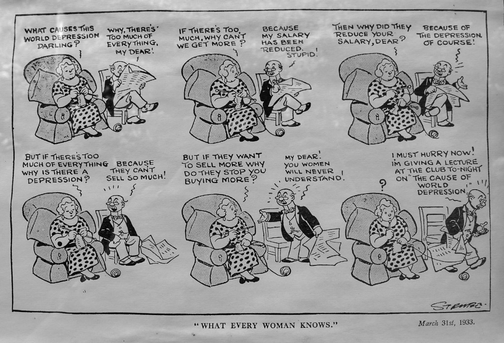

I took a picture of this cartoon stuck in the window of Hatchard & Daughters, a book shop in Howarth, Yorkshire (Where the Brontës used to live and write). It made me laugh because it is exactly the same conversations that are going on today but, as you can see from the bottom right corner, this is dated March 31st 1933.

I'm still looking for an explanation of how economic growth is linked to employment and pay - an actual mechanism that is!
