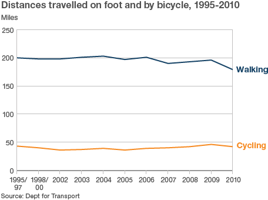

 

This graph, [taken from an article on the BBC News site](http://www.bbc.co.uk/news/health-20499005), says it all for me. People go on  about cycling being popular and cycle sales going up. They paint lots of lines on the road. They have campaigns. But for a real cyclist it just feels like it gets more dangerous and there don't seem to be that many more cyclists around. The ones there are come into the "macho" bracket - representing a small minority, mainly men, mainly young (or in a midlife crisis) and typically riding mountain bikes. No bike that lacks mudguards is really a means of transport - flame on.

This is the graph that matters and it isn't going up. In fact it has been flat like this for decades. Until we take major anti-car planning decisions the graph will stay flat. I don't see those decisions being made any time soon. Wake up and smell the diesel fumes!
