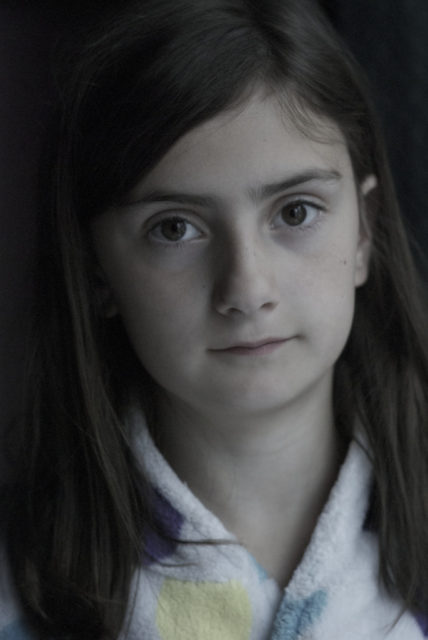
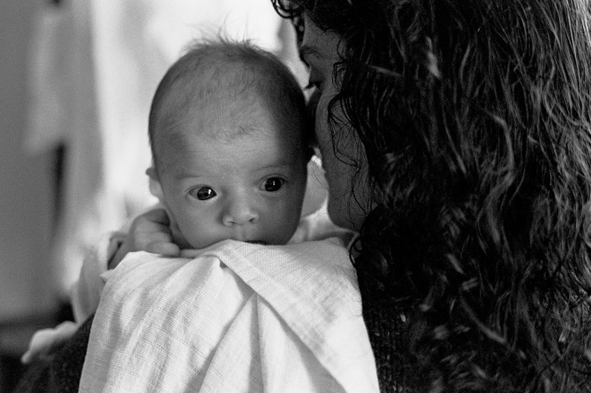
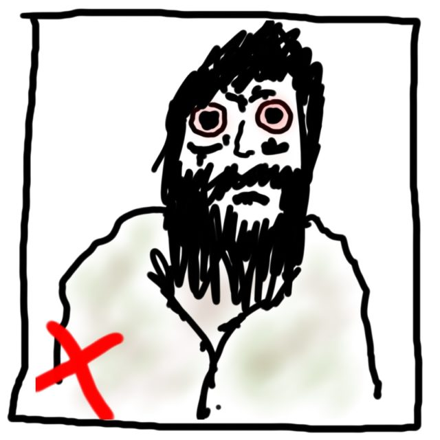
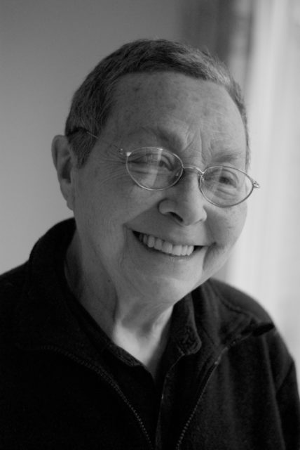
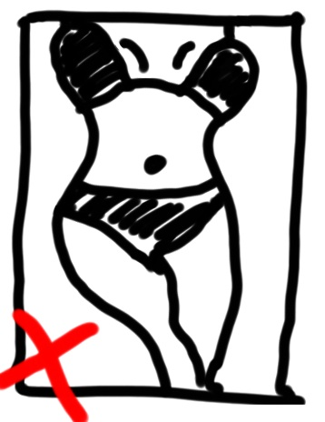
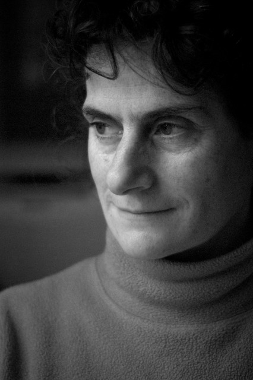

I would like to reconnect with my photography but I would like to do it in a way that is informed by my Buddhist practice and that becomes part of that practice. This topic has been in the back of my mind for some time but has now crystallized into this manifesto for action. A manifesto that I hope will also be of  value to non-Buddhist photographers looking for direction.

Key to my practice is the notion of [Right View](http://en.wikipedia.org/wiki/Right_view#Right_view) or "inter-being" as it is formulated by Zen teacher [Thích Nhất Hạnh](https://edwildgeese.wordpress.com/practice/thich-nhat-hanh/). We inter-are with each other and everything else; from the most distant star to the flea on the cat. Suffering is born of denying this truth. Joy comes from embracing it.

It seems easy to accept we are made of star dust but tough to admit our deep dependency on other humans. This lack of acceptance leads to the creation of barriers,  stereotyping,  prejudice and eventually violence. If we are to use our camera as a tool for positive change then it appears obvious we should use it to dissolve these barriers and that this should involve portraying others. This has potential both in the act of photographing and in the viewing of the photograph itself. Hence this manifesto is about **Portraiture** rather than any other form of photography.<!--more-->

I don't want to devalue the term **Mindfulness** by using it imprecisely. In mundane usage we may say "_Be mindful of you depth of focus._" This is **NOT** what mindfulness means here! In psychology mindfulness has been defined as "_paying attention in a particular way: on purpose, in the present moment, and nonjudgmentally_" (Kabat-Zinn, 1994). This is closer to the Buddhist meaning and to how it is used here. Buddhist practice is the act of infusing every moment of every day with this open, engaged awareness.

In order to achieve this continuous mindful awareness of life lay Buddhists follow five training principles. From a Judeo-Christian perspective it is tempting to think of these as rules like the ten commandments but you can't have rules if you haven't got a God to enforce them. The trainings are more like directions to a destination or guidelines. If you want to progress follow the guidelines. This manifesto therefore takes these five basic training principles as formulated by [Thích Nhất Hạnh](https://edwildgeese.wordpress.com/practice/thich-nhat-hanh/) and applies them to portrait photography. The test for whether  photography is "Mindful Portrait Photography" or not is whether it follows the The Five Wonderful Mindfulness Trainings as outlined below.

## Reverence For Life

In simplistic terms this is the "Do Not Kill" directive which seems to have little to do with photography. We use cameras not guns. But it is more than this. Each of the trainings has a positive side. _**We should celebrate life**_. It is about not killing the spirit of someone as much as not killing  them physically. The major way we kill a spirit in photography is by typecasting people.

If we treat someone as an example of something rather than an individual we are treading on them for our own purposes. Think of the endless pictures submitted to Flickr and other sites of street people. If we photograph someone for their grizzled, weather blown face then we aren't celebrating them as people. In MPP we may photograph a person who happens to have a fascinating, aged face but it is the person we photograph not the face. There is a big difference and you can see it in the final result.

## True Happiness

We make ourselves (and others) unhappy through exploitation, social injustice, stealing and oppression. Some versions of this training talk of abstention from "taking the not given" which fits very well with photography. It directly rules out candid portraits in MPP. We must engage with our subject so they know we are taking their photo - but is this enough? If we go to a poor area, smile, point at our camera and the person nods their consent is that enough? Can we then make an image and do what we please with it? In law there is a notion of informed consent. A nice quote from Wikipedia is "_An informed consent can be said to have been given based upon a clear appreciation and understanding of the facts, implications, and future consequences of an action._" In MPP the subject must give their informed consent, not in a legalistic sense, but in a moral sense. They must know what the photo is likely to be used for and ideally be given a veto if they feel they are being misrepresented.

## True Love

Traditionally this is seen as abstaining from sexual misconduct. What is or is not misconduct can be worked out by looking at the other trainings. If the activity involves killing (a relationship, family, trust), taking the not given (informed consent), lying (to yourself or another) or intoxication (driven purely by chemicals)  then it is probably misconduct. How does this apply to portrait photography? In MPP there is a need to differentiate between sexual attraction which tends to typecast the subject as an object of desire and genuine attractiveness which is characterised by an approachable openness - rather than legs and cleavage! Sexuality is part of the relationship between the subject, photographer and viewer. If it is a dominant part then the portrait will fail to communicate adequately and won't be MPP.

## Loving Speech & Deep Listening

It is tempting to reduce this training to a black and white "don't tell lies" or "always tell the truth". Both these miss the mark. There are many hypothetical and real life situations where it may be appropriate to mislead or evade answering. The training is much more about skill in communication. Has the photographer listened to the subject? Has the subject listened to the photographer? Is there really informed consent? Do we know enough about ourselves, our subject and our audience to be able to make images that promote deeper understanding? This is the core of MPP.

On a technical level this training implies using pretty straight photography with little by way of manipulation either in camera or via Photoshop. We shouldn't be trying to make people look younger or older or to appear to be in a more dramatic location that they actually are. But it does not rule out "skillful means". We can still pose the subject and optimise the lighting. Just not tell fibs!

## Nourishment & Healing

Traditionally this is avoiding substances that "intoxicate the mind" notably alcohol but of course including many other drugs. In the modern world there are new ways one might intoxicate the mind. Immersion in an excess of movies, video games or even literature are forms of intoxication. From the MPP point of view this training suggests we should avoid doing things that are just visually intoxicating. Press photographers pushed to make a striking image from a mundane story often employ these techniques. Examples are use of very wide or very long lenses or unnatural juxtaposition or repetition. You know it is getting bad when there is a massive pair of cardboard scissors for the new hair salon shoot or the photographer is on a ladder with a very wide lens shooting the entrepreneur surrounded by her employees. This is like adding sugar to bad coffee. In MPP we are trying to make good coffee in the first place.

## Just Do It

And that is it. Now I should shut up and start making portraits. But there is one final thing. To do this properly one has to drop the barriers and open up to others. There is no playing a role to get a result. This can be scary but it is where the learning comes in. Fear is only excitement minus oxygen so breath and enjoy the day.
