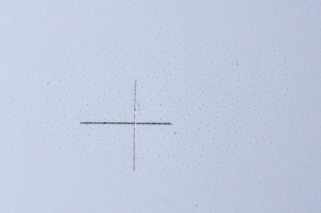
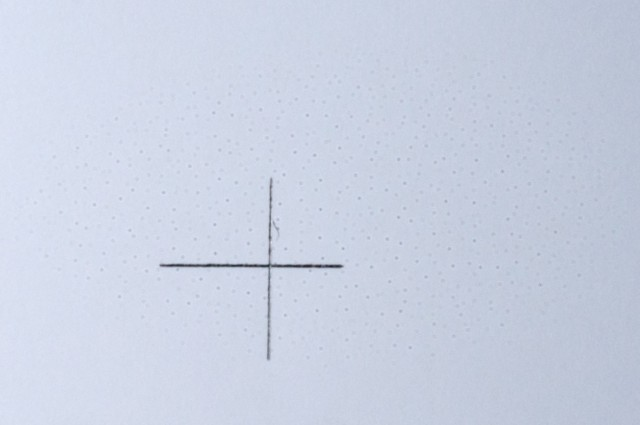

A couple of weeks ago I got my gorgeous Micro-Nikkor 55mm f2.8 serviced so that the diaphragm works again. [A.J.Johnstone](http://www.ajjohnstone.co.uk/) in Glasgow did a really nice service. I used to use this lens a lot for plant portrait work on Fuji Velvia. Some people say that 55mm is too short for macro work but for plants I prefer it a bit wider. My intention was to use it on my Nikon D80 which is a DX sensor so it would be 82.5mm which is just about perfect.

Here is one of my first shots of the inside of a tupil. It is actually a crop of the whole shot. If you look at it closely (click it to enlarge) you will see the pores on the stigma. But if you look too  closely you will see those pores spread onto the petals as well - which is odd.

It appears worse in shots with plain backgrounds. It must be sensor dust right. So I set about cleaning the sensor.<!--more-->

Below is a shot of a plain piece of paper (apart from the pencil cross for focus and alignment) at f32 a 1:1 crop. There is a cloud of dots around the centre of the frame. This is before I started cleaning.

\[caption id="attachment\_1913" align="aligncenter" width="640"\] F32 Prior To Cleaning\[/caption\]

I then exposed the sensor and tried blowing it clean with a [Giotos rocket](http://www.giottos.com/Rocket-air.htm) and retook the test shot but it made no difference. Next I used a [VisibleDust](http://www.visibledust.com/) sensor cleaning swab with VDust Plus solution and gently stroked across the sensor twice - like you would do to remove some dust. It made no difference other than one or two actual bits of dust were removed! I did another swab but more vigorously crossed the sensor eight times to no effect. Finally I used a third swab, got it quite wet with solution and gave it as good a scrubbing as I could (quiet gentle but you know what I mean). And the final result was....no change. If you look at the image below the pattern is just the same.

\[caption id="attachment\_1912" align="aligncenter" width="640"\] F32 After Cleaning\[/caption\]

I conclude this is not dust. I also conclude that it is not oil. The VDust Plus is supposed to be good for all contaminants and so I would imagine that it would make at least some dent in the pattern if the spots were oil. I would expect some of the faint spots to go and/or some of the heavier ones to get fainter but neither happens. The cloud of spots is suspiciously regular and right in the middle of the sensor. There are other examples of this pattern on the inter-web.

I think that this is a manufacturing fault that has developed over time as described in [this forum post](http://www.ifixit.com/Answers/View/109032/Tiny+spots+on+my+pictures.+Any+ideas#answer111049) by [Technician-X](http://www.ifixit.com/User/393721/Technician+X)

> This appears to be a defective infrared cutoff filter, and it is a defect seen on many D80, D40X and D60 Nikon image sensors . If you pull the filter and check the bottom under magnification, it almost looks like micro drops on the bottom side of the filter, like the coating didn't stick or is now coming off. It appears to be some sort of manufacturing defect - possibly contamination during the coating process on the bottom layer of the filter.
> 
> Unfortunately there is nothing that can be done for this other than replacing the image sensor, unless you want to convert your body to infrared. Nikon never sold the cutoff filter separately, and now that Nikon has stopped selling parts you can't even get the complete image sensor.
> 
> As usual, Nikon has never acknowledged the problem . . .

I'm actually fairly philosophical about this. I've had my D80 for six years and taken less than seven thousand shots (all good ones of course) so I don't expect it to be falling apart. On the other hand I think these spots have been there for a while and I haven't seen them. I did another test to see at what f-number they don't appear. They are hardly visible at f16 and gone completely at f11. If you are not doing close up work you really shouldn't be using f16 and up on a DX sensor anyhow because the diffraction will be trashing your resolution. On the other hand they must be degrading the image to some degree in all shots. But then the shot on the left is a 100% crop taken from an indifferent portrait of my wife (85mm f1.8 Nikkor at f4 ISO 100). This is not unsharp for an obsolete, degraded 10 mega pixel sensor!

I suspect there are many many D80 owners out there who have a spotty sensor and don't know or care. Good luck to them.

The big minus is that can't use the camera for what I want to use it for - and probably never will be able to.

Wouldn't it be nice if Nikon confessed to the error and did something like offer a token amount in trade in for a new DSLR. They would probably up their sales and make a profit on it.

The serial number of my camera is 8065072. If you have taken test shots (just shoot f22 against a plain background) and have the same problem why not add a comment below with your serial number in and we can see if there is a pattern.
