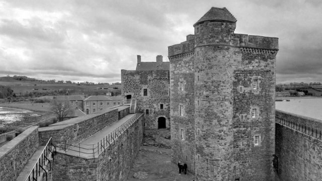
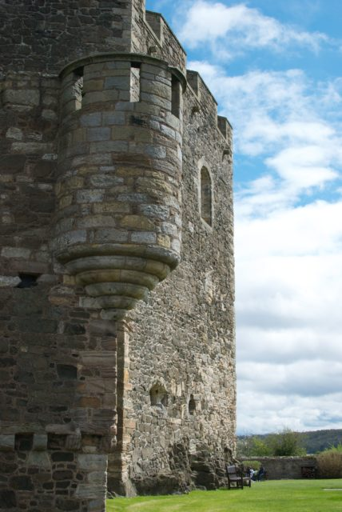
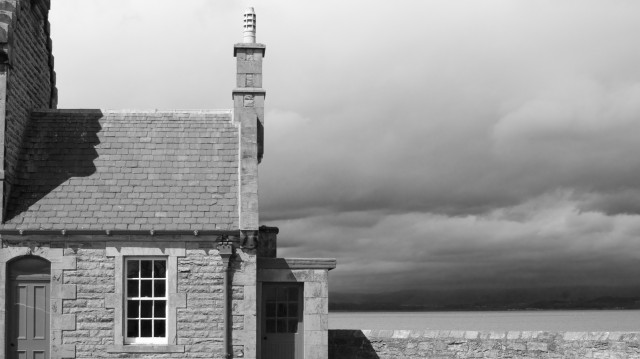
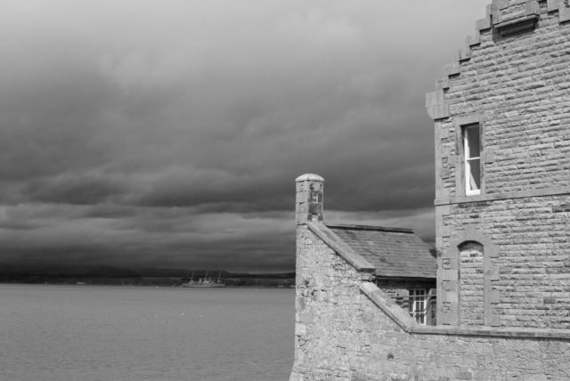
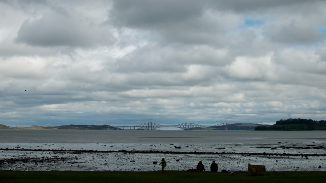
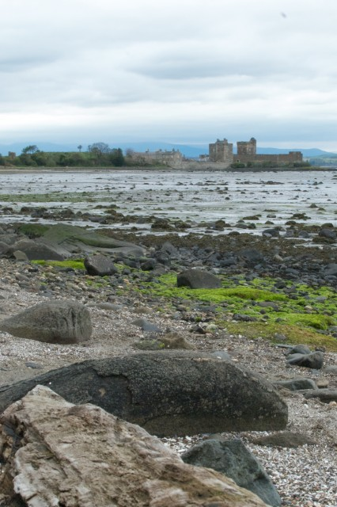

[Historic Scotland Property](http://www.historic-scotland.gov.uk/propertyplan/propertyoverview.htm?PropID=pl_035&PropName=Blackness%20Castle).

## Good For

Views of Forth bridges and lots of fresh air. Castle is really curious. Walking in woods along the coat to the East.

## Not So Good For

If there is a cold wind then it is really exposed so would not be very pleasant. Check opening times with Historic Scotland website first.

## Last Visit

Lovely visit on Sunday 5th May 2013 having tried to visit House of Binns but it wasn't open. Lunch in the van then around castle and walk in woods.<!--more-->

## Location

\[geotag currentpostmap="true" width="600" height="400" zoom="12" maptype="ROADMAP"/\]

## Photos

 

