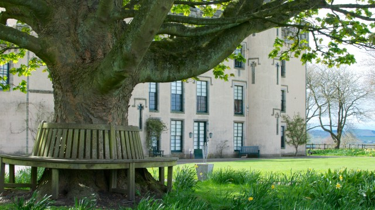
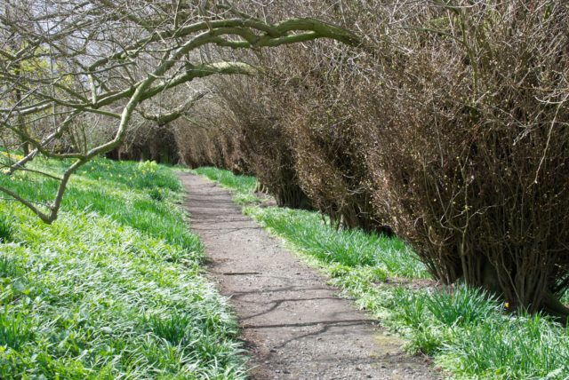
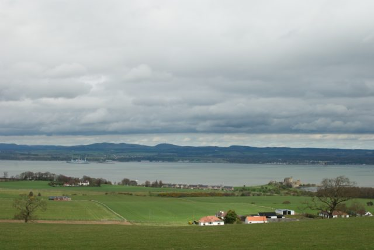

[A National Trust for Scotland Property](http://www.nts.org.uk/Property/House-of-the-Binns/)

## Good For

Views over the Firth of Forth. Not been in house yet.

## Not So Good For

Visiting out of short season. Wandering on your own - guided tours only.<!--more-->

## Last Visit

Sunday 5th May 2013 - Enjoyed stroll around grounds but house doesn't open until June and then only after 2pm.

## Location

\[geotag currentpostmap="true" width="600" height="400" zoom="12" maptype="ROADMAP"/\]

## Photos

