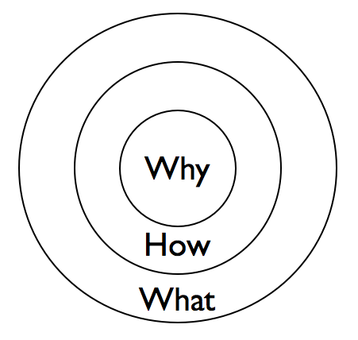
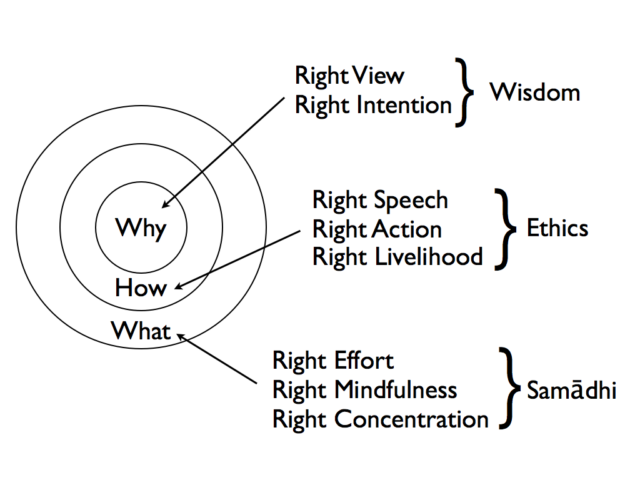

 As with many of the best things I can't remember how I stumbled on it but a few weeks ago I came across a TED talk by Simon Sinek called "[How great leaders inspire action](http://www.ted.com/talks/simon_sinek_how_great_leaders_inspire_action.html)". I was so impressed with this simple idea that I went on to buy Simon's book "[Start With Why](http://www.amazon.co.uk/dp/0241958229)". The idea is so simple that I don't think it stretches all the way to a book though. I can state it here in just a few lines along with Simon's golden circle diagram and you can watch the video below.<!--more-->

## The Idea

Most people know **what** they do. Some people know **how** they do it. Few people know **why** they do it. When we communicate we fall into the habit of talking about the tangible "What" of things first e.g. We are going on a family picnic. This is sometimes followed by the "How" e.g. We are doing it cooperatively together. But we often don't get to or just take for granted the less tangible "Why" e.g. Because we love each other. We tend to move from the outside of the circles inwards and this is a bad thing. We should move from the inside out. i.e. Start With Why.

Saying we love each other so we are going to cooperated on going for a picnic is far more motivational than saying we are going on a picnic and so we must cooperate. It also leaves open exactly what it is we end up doing. One member of the family might say they would prefer to climb a mountain together and that doesn't destroy family unity. If the communication has gone from the outside of the diagram inwards then saying you don't want to go on a picnic is tantamount to saying you don't love your family. If the motivations are made clear, by working from the inside out, then people have more freedom to be creative.

## The TED Talk

<iframe src="http://embed.ted.com/talks/simon_sinek_how_great_leaders_inspire_action.html" height="360" width="640" allowfullscreen frameborder="0" scrolling="no"></iframe>

## Mindfulness Training

What struck me was that this simple formulation can be used to explain my feelings about the Dharma and how we might provide training in Mindfulness techniques to a wider audience. For me it maps very well to the Buddhist Eightfold Path and may help design more secular interventions. Here is a diagram of how I map the Eightfold Path onto the golden circles.

The Eightfold path is the path that leads to the end of suffering. It is the fourth of the Four Noble truths. I like to paraphrase the four as "Life feels shit(1) because we want stuff to be different(2) but we can stop feeling shit(3) by following the eightfold path(4)". The path is the prescription and, most importantly, it is presented as a ordered series of steps. This is not to say that we don't repeat the path many times deepening our understanding on each pass. Even if the eight stepping stones are arranged in a circle they are still in order. The wisdom of right view leads to ethical conduct that leads to practice generating mindful states that leads to insights of deeper wisdom that leads to more ethical action etc etc. This is the image of turning the wheel of the Dharma or Dharmacakra with eight spokes - though sometimes it has more spokes!

Taking the content of a Mindfulness Based Stress Reduction course as an example of secular Mindfulness intervention then all the formal activities are linked to the "What" of the Eightfold Path. Here is a list pinched from [Mindfulness Wales](http://www.cynefin.org.uk/mbsrwales/index.php/the-course/4-mbsr-course-outine).

- Instruction in formal mindfulness meditation methods
- Body-scan meditation
- Mindful movement
- Sitting meditation
- 3-minute breathing space
- Instruction in developing an informal mindfulness meditation practice (mindfulness in every day life).
- Daily home practices of formal practice (45 minutes per day) and informal practices for the duration f the course.
- Discussions between instructor and group participants within the course sessions.
- Didactic elements/contextual information which link the practices to daily life and life challenges.

I am not saying the MBSR is a bad thing. It is saving lives. It is important that people take these steps of the path many times **but** unless they form part of that ring of stepping stones that includes ethics and wisdom MBSR type courses are not going to change the society that is making people sick. If we are to believe what Simon Sinek is saying about the importance of doing Why first then the MBSR course is more like Dell computers than Apple.

## Practical Implications

Attempts to teach mindfulness should start with the goal of establishing a world view that is consistent with Mindfulness practice. It may be that this is done in the context of getting people to do a body scan and introducing self reflection but it should be accepted that participants in courses will not make real progress until they have, at least intellectually, explored the nature of Right View. Thích Nhất Hạnh successfully communicates this in a very gentle way with his notion of interbeing. We don't have to smack people in the face with the t[hree marks of existence](https://en.wikipedia.org/wiki/Three_marks_of_existence) but we do need to start them on the path.

Healing does not come through Mindfulness alone it comes from the insights that come out of being Mindful. The nature of those insights is wordless but is founded on the Right View. If you have an intellectual/mental/moral world view that contradicts this then at best little progress will be made in terms of Mindfulness and at worst you will generate internal conflicts that will be uncomfortably and could even be damaging.

I may of course be wrong.
