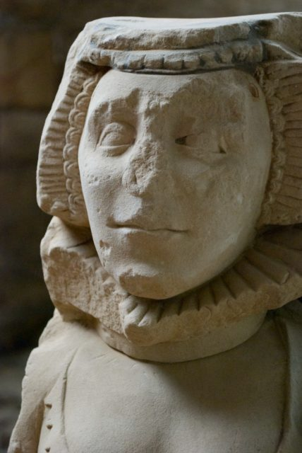
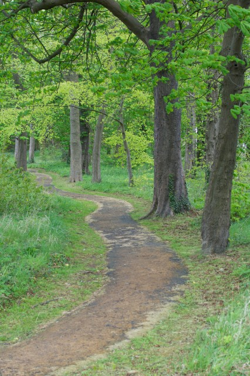
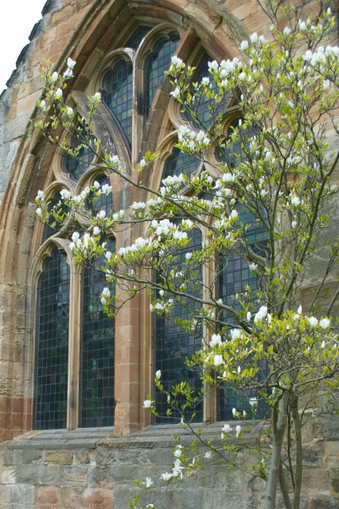
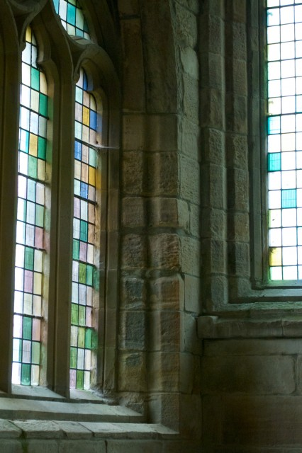

A [Historic Scotland Property](http://www.historic-scotland.gov.uk/index/places/managedproperties/propertyoverview.htm?PropID=PL_243&PropName=Seton%20Collegiate%20Church).

## Good For

Learning about the history of the area - battle of Preston Pans is not far away. Also good to stop on the way past. Could form part of a walk up from the coast.

## Not So Good For

A day out. There isn't that much there. Although it is a lovely spot there is the noise from the motorway, A road and railway. The day we were there there were people on trials bike in the field next door.<!--more-->

## Map

\[geotag currentpostmap="true" width="600" height="400" zoom="12" maptype="ROADMAP"/\]

## Last Visit

Sunday 11th May 2013 - Just two of us.

## Photos

