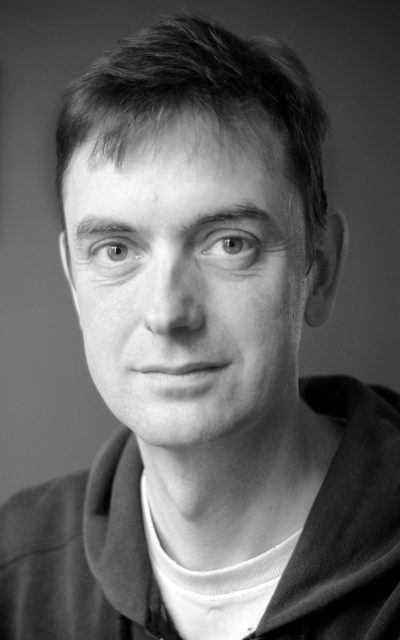

When I first heard of Engaged Buddhism I made a common mistake. I presumed it was all campaigns and demonstrations. I didn't think it was for me. I'd been on a few demos and sat on some committees but they all felt far too confrontational for my newly developed sensibilities. Now I had a family and a job as well as the practice. If I was going to become a social activist it would have to wait a decade or two. Maybe when the kids have left home or in that period between my eventual retirement and the crematorium.

My dismissal of Engaged Buddhism didn't sit comfortably. The vow to share the fruits of the way with all beings was becoming increasingly heart felt. In a moment of frustration I said silently “I'm more of an Embedded Buddhist than an Engaged Buddhist.” It was like hitting the right combination on a safe. There was a click and the door swung open.<!--more-->

I was thinking of the controversial practice of embedding journalists with military units. In return for obeying rules set out by the military, journalists are allowed to travel under the protection of soldiers in a war zone. This gives them access to places they couldn't get to otherwise but of course leads to them only seeing the conflict from one side. If you eat, sleep and share joys and sorrows with someone then you will bond with them more that those on the other side of the conflict. In the worst case you become a cheer leader for “our boys” over “the enemy”.

For me the analogy works very well. I am embedded in a society with family, social and financial bonds pulling in many directions. There are people and institutions I share my life with and depend on for love and protection and they depend on me too. I wouldn't want it any other way. Yet through my practice of the Dharma, I have become something different. More like the journalist amongst the troops. A seeker of Truth not victory.

Like the embedded journalist being an embedded Buddhist takes effort if it is not to “go native”. One has to keep coming back to being an observer of this moment, fully aware of what is going on and not swept along by events. Formal practice and sharing feels like taking notes and filing dispatches – a little like Robin Williams reporting back to Orson in Mork and Mindy (Google it young guys!).

Of course I realised that my notion of being an embedded Buddhist is just what Thay means when he talks about Engaged Buddhism. It is interbeing. I joined up those dots pretty quick. My practice is changing me and everyone else because they are in me and I am in them. I just need to carry on practicing and interacting with people and I will change society.

There are parallels with embedded journalists here too. During the Vietnam war it was credited for helping fuel the anti-war movement. The reporting had become too close to the truth. In subsequent conflicts journalists have been much more tightly controlled. In the Gulf war journalists were ejected for breaking the rules. The embedded Buddhist can learn from this. We must use loving speech and deep listening if we are to remain embedded and not be ejected from the society that both supports us and that we hope to change.

It is nice to feel that I am an engaged Buddhist even though I lack a banner or petition. Maybe sharing my notion of embedding will help someone else see that they too are engaged.

\[This article first appeared in the news letter of the [Community of Interbeing in the UK](http://interbeing.org.uk/);  [Here & Now](http://interbeing.org.uk/resources/here-now/) July 2013\]
