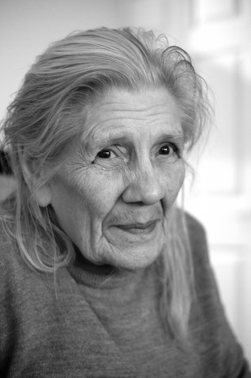
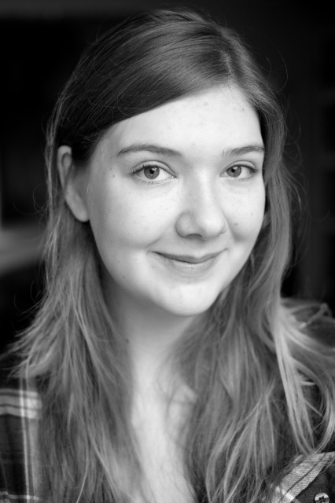

\[column-group\] \[column\]\[/column\] \[column\]\[/column\] \[/column-group\]

These are two photographs from my series of [100 Portraits in 2013](http://www.hyam.net/blog/archives/2033). Sheila, my mother-in-law, is 86 years old and Mary, her granddaughter, is 18. These were among 48 portraits I made in 2013. I failed to make it even half way to 100 portraits but I learnt a lot. It is difficult to put into words what I have learnt but it feels good and so I am going to keep going till I get to 100. I'd like to be done by the summer of 2014 so it will have taken me about a year in total. I don't want it to drag on for ever. I'd like to move on to a more specific people project but I won't start that till I have reached my 100.
