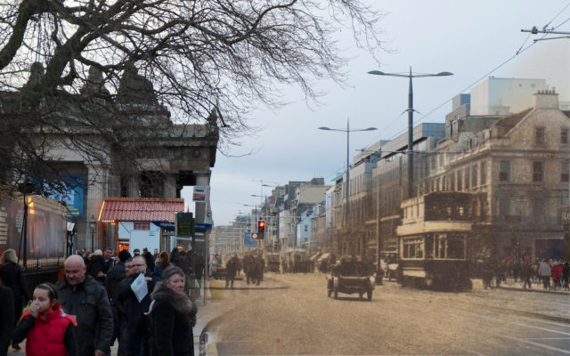
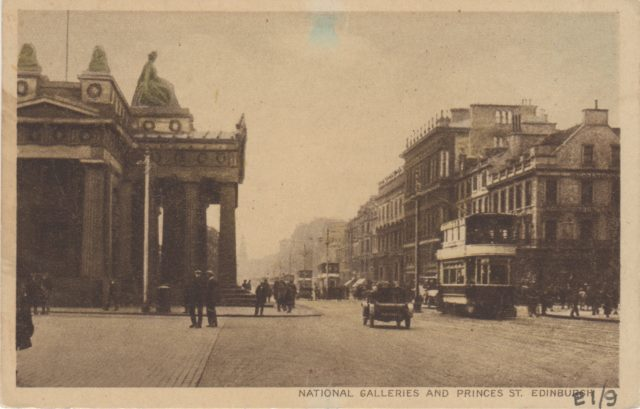
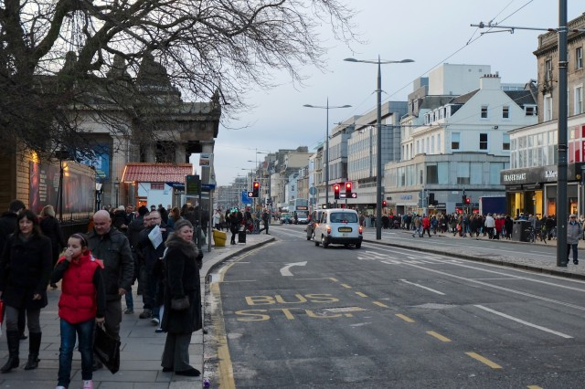

\[caption id="attachment\_2119" align="aligncenter" width="640"\] See a better version of this [here](http://www.hyam.net/blog/archives/2193)!\[/caption\]

I have not blogged for a while. I'm not sure if the urge has left me or if I just haven't found time. There seem to be too many words in the world so I'd like to move to doing more visual stuff and this tends to be sucked into [my Flickr stream](http://www.flickr.com/photos/rogerhyam/) rather than my blog.

I usually do something over the Christmas/New Year break that is a bit of fun and this year I started dabbling in [rephotography](http://en.wikipedia.org/wiki/Rephotography). Living in such a historic city should provide many opportunities. Above is my first example. A tram back on Princes Street. Below are the two source images I worked from. The modern shot was taken around New Year. The postcard is about 100 years old. I'd like to go back later in the year when the new trams are running and see if I can merge an image of both old and new.

