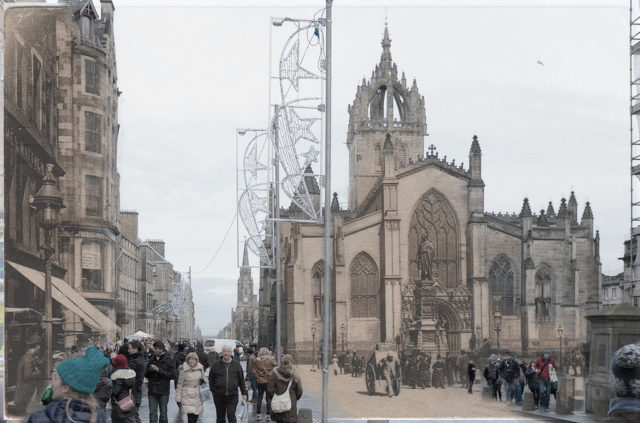

This is a lovely postcard combined with a quick snap. I'll have to go back when the Christmas lights are down and it maybe isn't so crowded. I also need to find historic images in which people figure more prominently. It is people who are interesting after all!
