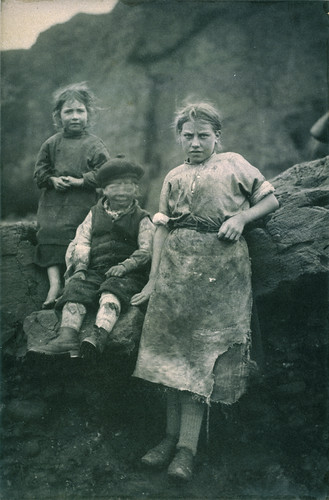

 [At Auchmithie](http://www.flickr.com/photos/nationalgalleries/3095145425/), a photo by [National Galleries of Scotland Commons](http://www.flickr.com/photos/nationalgalleries/) on Flickr.

I find this shot from the National Galleries collection strangely moving. It was taken in 1881 up the coast from Dundee. The older girl (a working women really) is wearing the apron of someone who processes fish (probably gutting them). She is wondering what the hell the photographer is doing. It is exactly the face I pull in many of the pictures my wife takes of me. I never quite trust her with my camera. The boy can't sit still and has moved his head. I sense he is laughing. The girl on the left I feel I really connect with.

I'm aware that the building I live in was constructed in 1884 when these children were just a little older. The foundations were probably going in when the photograph was taken.

I'm aware that the fish stocks were largely destroyed by over fishing of which this was probably a part. Would we feel the same for loggers in the Amazon?

Photographs of people and a little context have a special kind of power to move.
