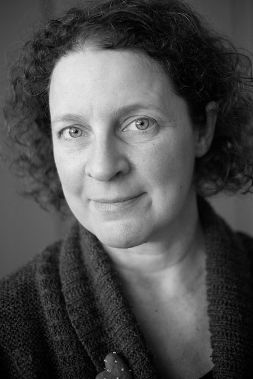

I'm really pleased with today's photo. Tamsin comes along to the meditation group on Fridays and for breakfast after. The room has two story South facing windows. At this time of year we finish up soon after dawn so the light can be really variable but is often incredible. I took ten shots. It took eight to get the position in the room right and for both of us to relax. This is the nineth shot.

After this I tried to photograph Fiona who I see through her office window several times a week. The shots were a complete disaster! You can't win them all. I'll have to try again another day.
