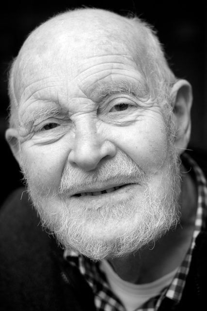

I finally managed to get talking to Jimmy when he was free and I was free and the light was OK. We stepped outside to a covered area with soft light. Still a bit top heavy but not bad. I took about ten shots. There were two shots I liked, one with hat and glasses which is more conventional and then this one.

I really enjoy making these images and am so grateful that people let me do it.
