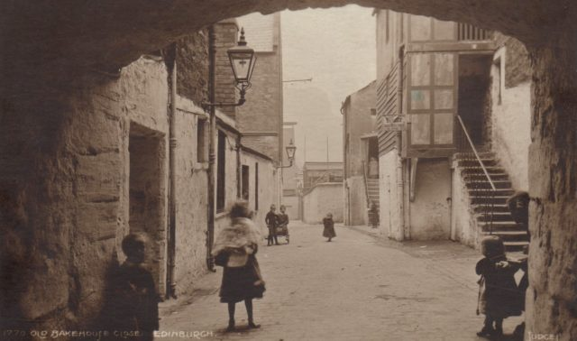
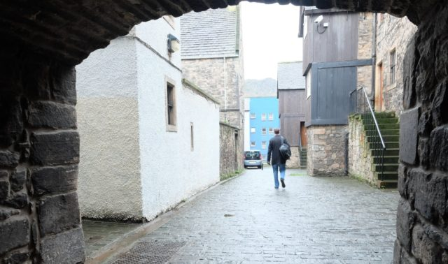

\[php\] wp\_enqueue\_script('ghost\_fader', 'http://www.hyam.net/blog/wp-content/ghost\_fader.js'); \[/php\]

 

I've been having fun this weekend with a postcard that was posted in 1925. I think the image on the card was taken quite a bit earlier maybe even at the end of the 19th century. The scene is of Old Bakehouse Close, Edinburgh, off the Royal Mile. The area has been much renovated and looked after so in many respects is unchanged but in many ways is totally different. Here I merge between a photo taken yesterday (18th January 2014) and the ghosts of probably on hundred years before. For me it really captures the feel of walking through ghosts as I cross Edinburgh to get to work. (If I have got my Javascript right the two images should be fading between each other above).
