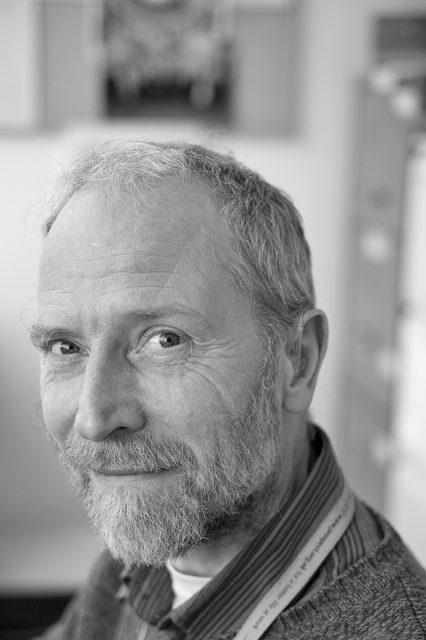

I had warned Stephan I might catch him for a photo and he was very relaxed about it. He seems comfortable in his own skin.

Stephan's office is quite narrow with a massive North facing window so the contrast was low. This B&W conversion was done in Silver Efex. I can't decide if I am happy with it or not. It is close to what I was visualising but the raw could be interpreted in many other ways.
