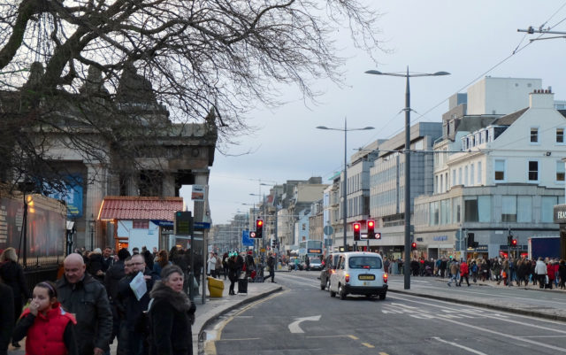
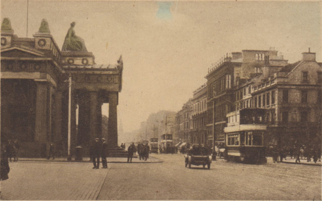

\[php\] wp\_enqueue\_script('ghost\_fader', 'http://www.hyam.net/blog/wp-content/ghost\_fader.js'); \[/php\]

 

Fading between these two shots is a much better approach than trying to merge them like I did in an [earlier post.](http://www.hyam.net/blog/archives/2118)
