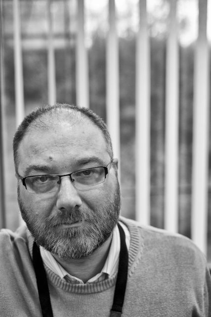

The dreek weather and short days continue. This shot was taken at 1:10pm and that is a South facing window! I decided to use the interal lighting in the library rather than the window light and stood on a kick stool to try and get some light on Graham's face.

Graham was really good to let me take this shot. He was right in the middle of something and I just dragged him away with little explanation. The result is a gritty shot of a man who is would probably rather be doing something else!
