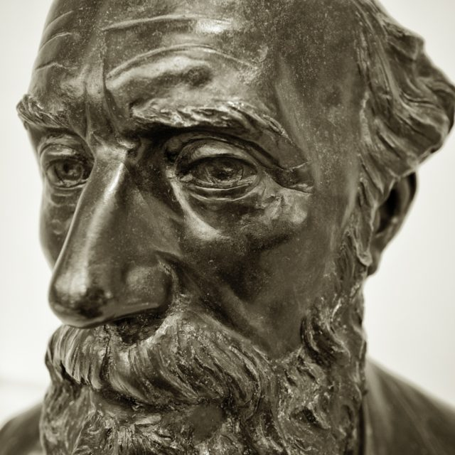

I just had my letter to the Guardian Weekly published. I was responding to [Zoe Williams](http://www.theguardian.com/profile/zoewilliams) article "[Come on, atheists: we must show some faith in ourselves](http://www.theguardian.com/commentisfree/belief/2014/jan/15/atheists-show-faith-in-ourselves-civic-exclusion)" which took the very narrow view of religion vs atheism that seems to be popular at the moment. You can see my letter on [the letters](http://www.theguardian.com/global/2014/feb/04/guardian-weekly-letters-7-february) page along with others for and against. In it I say:

> Several times a week I bow to a shrine and light incense before sitting in meditation with a small group of other people. I am an atheist, but not the kind that Zoe Williams seems to have in mind in her column [(24 January)](http://www.theguardian.com/commentisfree/belief/2014/jan/15/atheists-show-faith-in-ourselves-civic-exclusion).
> 
> I am a Zen Buddhist so I actively cultivate a mind free of the notion of a personal saviour or a distinct soul. Unlike Williams, I follow a precept not to indoctrinate my children into my beliefs, let alone raise them to believe that other people are mad for their beliefs. Strangely, I probably have more in common with contemplatives from theistic religions such as some Sufis and Christians than with what Williams describes.
> 
> The kind of atheism she talks about seems to have a lot in common with the Deobandi Islam described by Jon Boone [(Moderate Islam under siege in Pakistan)](http://www.theguardian.com/world/2014/jan/15/islam-pakistan-barelvi-saudi-wahhabi). Her views are characterised by absolute certainty of her position (dogmatism), a presumption of uniformity of view across atheists (intolerance of heresy) and perceived victimhood.
> 
> I think Williams may have been radicalised by the fundamentalist cleric Richard Dawkins and should be watched closely by the NSA, but then she probably already is.
