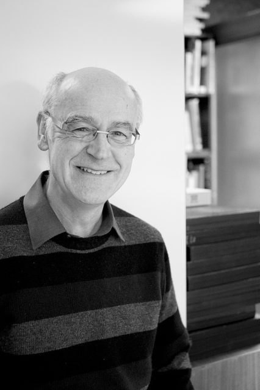

David is one of our senior scientists who is just about to leave (partially retire?) to live abroad. He works on Diatoms which are considered 'lower' plants and so his office is in the basement. The sun had come out briefly and provided just enough light into the room.
