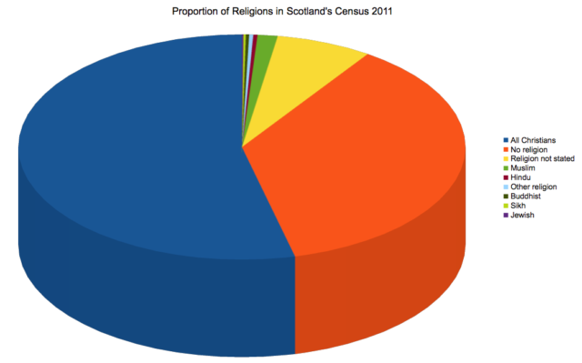
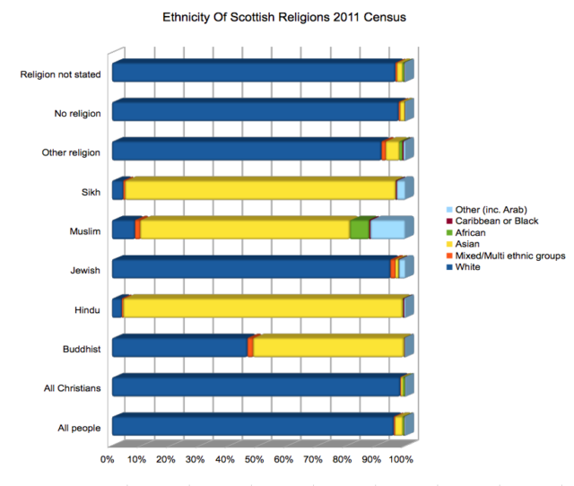

The 27th February saw the launch of the [latest set of figures from the 2011 Scottish census](http://www.scotlandscensus.gov.uk/news/important-message-release-3a-tables). I had been waiting for this release partly because it arrived in time for my birthday on the 28th but also because I had been in correspondence with the census team and they had kindly agreed to put some more tables in this release on religion. I'm interested in Buddhists in Scotland - or at least people who may or may not call themselves Buddhists.

I'm very aware that many of the people I mix with in my Sangha and others don't call themselves Buddhist and I can appreciate why. So this is more an analysis of people who choose to call themselves Buddhist on a census form rather than necessarily people who practice mindfulness or the Dharma. But it is still interesting stuff. Firstly there are very few of us! 12,795 people self reported as Buddhist which is less than a quarter of 1% of the population. The pie chart above and the table below shows this is relation to the other religions reported. You could expect to have to ask 400 people at random before you found a Buddhist. Compare this with having to ask two people before you found a Christian or three people before you found someone who professed no religion at all.

## Table 1: Proportion of Religions in Scotland's Census 2011

| **All Christians** | 53.82% |
| --- | --- |
| **No religion** | 36.66% |
| **Religion not stated** | 6.95% |
| **Muslim** | 1.45% |
| **Hindu** | 0.31% |
| **Other religion** | 0.29% |
| **Buddhist** | 0.24% |
| **Sikh** | 0.17% |
| **Jewish** | 0.11% |

On the other hand Buddhism holds its own as one of the "minor" religions. After you take account of "Christian", "Nothing" and "Not Telling" categories we are left with only 2.57% of the population who do something else. More than half of these are Muslim and about one tenth Buddhist. One surprise for me is that there are so few people who report themselves as Jewish in Scotland.

Things get interesting with the cross tabulation with other questions on the census. The bar chart below shows the percentage ethnic make up of each religion.

Scotland is 96% white and Christians appear to be even more white at 98% but that is as much to do with a large proportion of the people who are not white not being Christian - if that make sense. The figures not reporting a religion or not religious are very similar to the proportions of the population as a whole (97.6% and 96.6%) so it appears that people of different ethnic groups are just as likely to be non-religious although it would need a proper statistician to check this for sure.

Hindus and Sikhs are 95% and 92% Asian. Muslims show more diversity reflecting the greater geographical spread of the religion in Arabia, Asia and Africa. As a percentage there are more white Muslims than white Hindus or Sikhs but this is still relatively small proportion at 7.8%.

This is where Buddhism departs markedly from the other "minor" religions in Scotland. The Buddhist community in Scotland is 51% Asian and 46% white although because of the small total numbers there are about the same number of white Buddhists as there are white Muslims (5,903 vs 5,983). Of that 51% Asian Buddhists roughly half fall into the category Asian Chinese and half Asian Other which would include Thailand, Cambodia, Myanmar, Bhutan, Sri Lanka etc. but we don't have the break down.

What does this all mean?  It could be read that Buddhism is a growing religion in Scotland by conversion. [Figures from the 2001 census](http://www.scotland.gov.uk/Publications/2005/02/20757/53570) show that there are nearly doubled as many Buddhists (88% rise) in ten years from 6,800 (0.13%) and the ethic make up being roughly the same as now implies that half came from migration from Asian countries and half from conversion of indigenous population. Of course white Buddhists moving to Scotland could have caused it as well but is less likely.  The number of Muslims increased by slightly less (80%) but the number of Hindus went up by a whopping 192% and the white proportion of these religions also remained similar. The total population rose by about 4.6%.

It could also point to Buddhism in Scotland being a religion in two parts. There are people for whom it is the religion of their birth who still identifier with it but don't observe it particularly (like many Christians) and there are those who have taken it up and I suspect are more likely to practice actively. It seems counter intuitive that people would adopt a religion to the point of writing it on a census form would not actually be taking part in it in some way. Unfortunately, unlike the 2001 census, this one did not ask about religion of up bring. That survey said:

> "Those persons whose religious background is Other Christian are most likely to respond that they now have no current religion (23%). This is closely followed by Buddhists at 21%."

Traditional Buddhist culture may be no more resistant to the decline in religiosity than Christian but maybe the new Westernised forms are more appealing?

There is much more to look at but I am going to bed!
