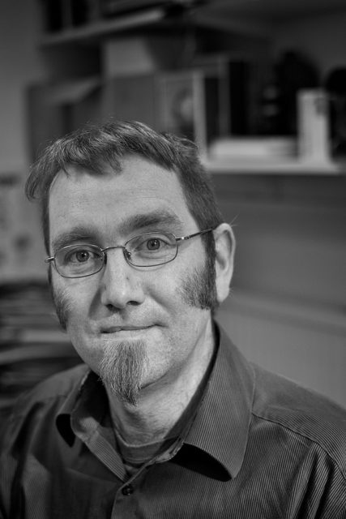

Greg runs the education programs and is such a nice guy. We talked about work whilst he ate his lunch and took a couple of calls then sat quickly for a portrait. Multitasking whilst remaining totally unflappable.

The sun has been shining but Greg's office has a window that faces another building and fire escape so the light was really bad till the sun hit a stainless steel pipe outside and bounced into the room. Looks a bit odd but I like it.
