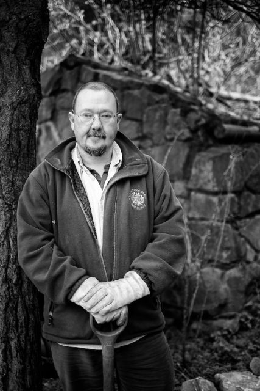

Andy has worked at the botanics for over 25 years and is actually a lot more cheerful than he appears in this photo - but I like the shot. He was working with [Norman](http://www.hyam.net/blog/archives/2367 "100 Portraits: Norman") on the organ donor memorial.
