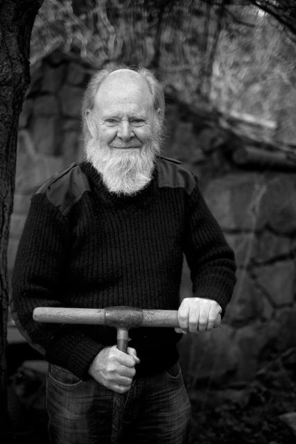

Norman was working with [Andy](http://www.hyam.net/blog/archives/2370 "100 Portraits: Andy") to build the National Organ Donor Memorial in the gardens. He is a drystane dyker by trade but many years ago he was a student at the botanics. A fascinating guy to talk to.
