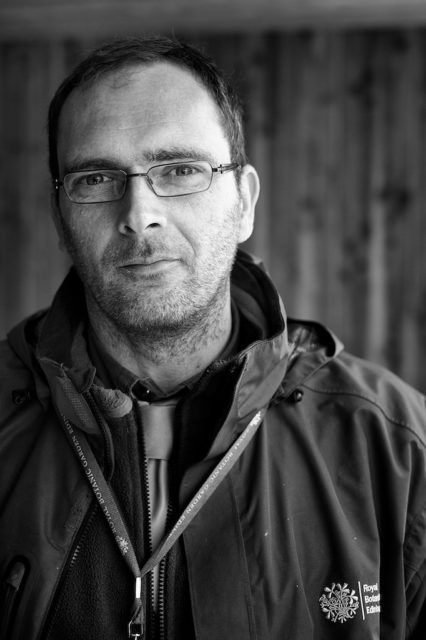

Finally got around to photographing Reuben. We had just been having a meeting about putting children's drawings on line and generally sorting out the problems of the world. At the end of the chat Reuben stepped outside for a smoke and let me take his photo. He is tall so I had to stand on a pallet. We moved under the cover of a kind of loading bay area as the general light was very overcast. Really pleased with this shot.
