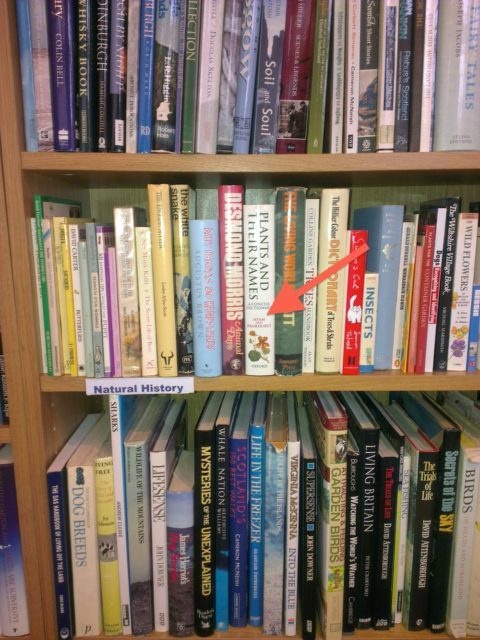

Back in 1995 (nearly 20 years ago) I published a book with Richard Pankhurst. It was actually a dictionary but that doesn't stop me talking about "my book" as if it were a novel when it is appropriate for bragging purposes. Sadly Richard died last year but I think he would have laughed.

I was in a second hand bookshop last week (it is a weakness a lot of us suffer from) and there was my (our) book. I've seen it cropping up in libraries but this is a first for a second hand book shop. I note the pages were yellowing already. They were asking £2.50 for it which I think was a bit steep. I didn't offer to sign it though my inner Gilderoy Lockhart was twitching.

J.R. Hartley? You must remember the ad for yellow pages - but then it was 30 years ago.

<iframe src="//www.youtube.com/embed/nv1VQ7uSC-s" width="640" height="480" frameborder="0" allowfullscreen="allowfullscreen"></iframe>
