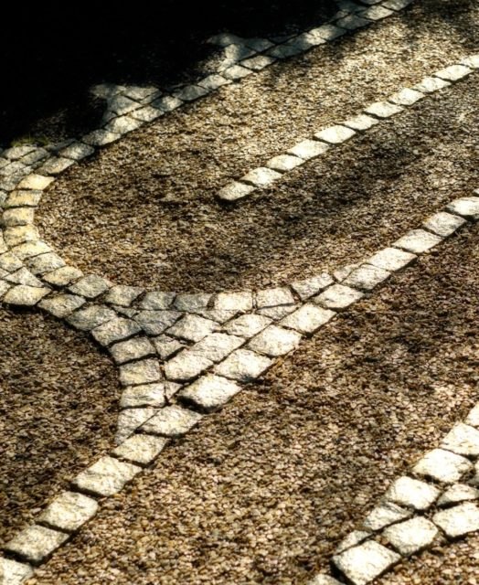

\[caption id="attachment\_2391" align="alignright" width="227"\] Edinburgh Labyrinth\[/caption\]

Life can feel as if it is made up of a series of episodes; as if we are living from moment to moment. This is an illusion. There is only one, all encompassing moment. We are fooled because we don't pay attention to it the whole time.

This one, absolute moment is our _True Home_. We may leave it to wander in our dreams or wallow in memories but we are only fully alive, truly content, completely healed when we return home.

I walk to enter my _True Home_. This is a description of what I do when I walk:

- I try to walk somewhere I feel safe. Somewhere beautiful. Somewhere green.
- I walk slowly, smoothly, silently.
- I synchronise my walking and my breathing.
- Sometimes I take two steps for the in breath and two steps for the out breath. In ~ step, step. Out ~ step, step.
- Sometimes I just step with each inhalation and exhalation. In ~ step. Out ~ step.
- When I notice I am distracted I just come back to my steps and my breathing accepting my distraction as part of the experience.
- Sometimes I say to myself a simple [gatha](http://en.wikipedia.org/wiki/Gatha) as I walk. One step per line:

> I have arrived I am home in the here in the now I am solid I am free in the Ultimate I dwell

- Sometimes even the gatha is too much and I reduce it to Arrived~step. Home~step.
- If I am walking with a friend we invite a small bell to sound before we start.
- If I am alone I imagine the bell.
- I either set a timer on my phone or decide a path I will walk so there is no distraction of think "Am I done yet?".
- Twenty minutes is a good duration.
- Occasionally I walk a labyrinth as the path.
- I look for peace in every step not in the destination.
- At the end I say thank you.
- As I walk away I feel the power of mindfulness seeping into the rest of my life.

I am grateful to my family, friends and teachers (especially [Thích Nhất Hạnh](http://en.wikipedia.org/wiki/Th%C3%ADch_Nh%E1%BA%A5t_H%E1%BA%A1nh)) who have created the conditions that enable me to practice.
