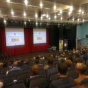

I went to a set of evening lectures at the University of Edinburgh last week called ["Mindfulness for Depression: Theory and Practice"](https://www.eventbrite.co.uk/e/mindfulness-for-depression-theory-and-practice-tickets-11220678351). It was a really good evening as an introduction to the subject.  [Prof. Stephen Lawrie](http://www.ccbs.ed.ac.uk/members/profile.asp?staffID=4) presented an overview of depression and what a bad thing it was both to the individual and to society as a whole. [Dr David Gillanders](http://www.ed.ac.uk/schools-departments/health/clinical-psychology/people/teaching-staff?person_id=20&cw_xml=profile.php) presented Acceptance Commitment Therapy (ACT) as an example of a modern therapy that uses mindfulness and [Prof Stewart Mercer](http://www.gla.ac.uk/researchinstitutes/healthwellbeing/staff/stewartmercer/) presented on what mindfulness was and where it came from. Before the questions we had a few minutes of mindfulness practice very well lead by Stewart. The room of several hundred people fell totally silent. It was powerful stuff.<!--more-->

I couldn't resist getting a question in. Stewart had put up a slide of the Eight Fold Path to point out where Mindfulness had come from. I asked how the other seven parts of the path had been rejected. Was it on the basis of empirical evidence? I made the point that I thought the seven were actually being shoehorned back in by the different therapeutic interventions on offer. Stewart did a good job of answering but relied heavily on invoking [Jon Kabat-Zinn](http://en.wikipedia.org/wiki/Jon_Kabat-Zinn) as the father of secular mindfulness. He said that Jon had actually included aspects of other parts of the path but had omitted religious elements especially around [anatman](http://en.wikipedia.org/wiki/Anatta) (non-self). There was a big audience and, of course, no chance for dialogue but the exchanged moved my thoughts on and here they are.

## My Thesis

1. The core Buddhist teachings and most modern therapeutic techniques are maps of the same terrain - the human psyche and how it relates to the world.
2. Buddhism is no more of a belief system than the empirical scientific method is.
3. Secular mindfulness interventions have abandoned key parts of Buddhist teachings because of values prevalent in a predominantly theistic (Abrahamic), capitalist culture. They therefore have a greater level of "religious pollution"  than the Buddhist teachings from which they claim to have been derived.

Number three is the biggie and I hope to demonstrate it by briefly looking at the eight parts of the Buddhist Noble Eight Fold path and seeing how they have been adopted or rejected by current "secular" mindfulness based interventions.  I'll go in non-traditional order for obvious reasons but number them traditionally. This is not meant to be exhaustive. Later I'll talk about the origins of "secular" mindfulness in Massachusetts.

## 7) Right Mindfulness

Obviously mindfulness has been appropriated from the Buddhism though there are indications of it occurring in other religious and non-religious contexts. There has been much discussion on whether what is taught in MBSR, for example, is "real" mindfulness in the sense of Buddhist texts but for current purposes it is near enough. **1/8 adopted into secular practice.**

## 8) Right Concentration

This is so bound up in mindfulness that it can be taken as read that it is used by all schools. You need it on a trivial level to do the body scan but as you delve deeper it is a matter of being focussed on your mindful experience - becoming one pointed. **2/8 adopted into secular practice.**

## 6) Right Effort

I prefer Thích Nhất Hạnh's use of Right Diligence for this as it conveys the meaning more accurately. To make progress either on a spiritual path or in recovery from illness (same difference?) we need to work consistently and not in such a way to damage ourselves or others. To accentuate the positive and not the negative. It is in every course. If you have done an MBSR course you will know the emphasis on consistency of practice is very strong.  Even if you are in Freudian style analysis you have to turn up for you sessions! **3/8 adopted into secular practice.**

### 2) Right Intention

How many psychologists does it take to change a light bulb? Only one but the bulb really has to want to change. Ha ha. Having the resolve to change in a healthy way; show me the mindfulness instructor or Zen master who doesn't either expect it within her students or hope to inspire it. There is a got-you here but I don't think it is a game changer. The will to change within Buddhism is the will to see things as they really are - having had some kind of glimpse of insight through whatever means. This is the arising of [Bodhicitta](http://en.wikipedia.org/wiki/Bodhicitta) \- the will to enlightenment. In the context of secular therapy this could be thought of admitting you are ill and are not seeing the world correctly. The analogy of the path being the medicine and the Buddha the prescribing doctor is used so often it would be churlish to say that the intention to get better from mental illness and the intention to get better from the illness of delusion were different and not a matter of degree especially when we consider the positive psychology movement.   **4/8 adopted into secular practice.**

## 1) Right View

I used to think this would be an insurmountable hurdle but it actually only comes at half way through my list. The only example Stewart mentioned of things to avoid in Buddhism was not going near non-self. Yet during his talk David Gillanders actually got us to do an exercise to induce existentialist angst (he didn't call it that). We held our hands over our face with our fingers open so we viewed the world through a lattice work. We couldn't see the world well and we couldn't see our fingers well either. Then he got us to straighten our arms so our fingers were in focus and we could see both them and the room better. This was a metaphor for being caught in our thoughts or distancing ourselves from them. He was illustrating the first principle of ACT,  **Cognitive Defusion** i.e. Learning methods to reduce the tendency to reify thoughts, images, emotions, and memories. So what am I if I am not my thoughts, images, emotions and memories? All the mindfulness therapies I am familiar with contain this kind of logic but try to discourage you from following it through. Probably a good thing for seriously ill patients but not for the mildly depressed and worried well. **5/8 adopted into secular practice.** If you follow me this far then secular mindfulness interventions have adopted the majority of the core teachings of Buddhism!

Thích Nhất Hạnh invented the term Interbeing as an expression of Right View. We only exist at the junction of all these other events going on. We are entirely made of non-self elements. This is 100% the view of any atheist scientist (like me). The only reason to reject I can think of would be a religious one.

## 3) Right Speech

Here things might start to get tricky because this is the first of the ethical section of the path. Traditionally thought of as not lying it is actually more subtle than that and implies mindful, constructive speech for example "In the case of words that the Tathagata \[Buddha\] knows to be factual, true, beneficial, and endearing and agreeable to others, he has a sense of the proper time for saying them. ". I'm reminded of an interview with [Martin Seligman](http://en.wikipedia.org/wiki/Martin_Seligman) (a.k.a. The Father of Positive Psychology) where he was asked what the one thing one should do that would make one happier. He said that we should think of someone in our past to whom we are grateful. Write them a letter saying how grateful we are but not post it. Go and read it to them. This is proven to increase happiness. Now tell me it isn't an example using Right Speech for therapeutic effect with empirical support! There are plenty of studies out there that lying causes stress and stress causes illness. This is empirical science. **6/8 adopted into secular practice.**

## 4) Right Action

This is the abstaining from taking life, from stealing, and from sexual misconduct. Before we get too prudish in my tradition sexual misconduct is sex outside a loving relationship made known to others (the relationship not the sex!) so we are not far off normal social norms. Unfortunately here is where I start to give up on binding the Buddhist path to secular interventions but I am going to give this half a mark because  I believe that it is demonstrable that a life of crime (as with lying)  increases stress and so is bad for your mental health so most therapies/therapists would steer people away from it. As with all ethical matters it crosses into politics as much as religion. Killing humans is usually OK if the state is doing it (e.g. war and capital punishment) but not individuals. **6.5/8 adopted into secular practice.**

## 5) Right livelihood

I make no attempt to say this has be adopted by secular mindfulness interventions and it kind of makes my point. Traditionally there have been five prohibited businesses (cut'n'paste from Wikipedia):

1. Business in weapons: [trading in all kinds of weapons](http://en.wikipedia.org/wiki/Weapons_trade "Weapons trade") and instruments for killing.
2. Business in human beings: [slave trading](http://en.wikipedia.org/wiki/Slave_trading "Slave trading"), [prostitution](http://en.wikipedia.org/wiki/Prostitution "Prostitution"), or the buying and selling of children or adults.
3. Business in meat: "meat" refers to the bodies of beings after they are killed. This includes breeding animals for slaughter.
4. Business in intoxicants: manufacturing or selling [intoxicating drinks](http://en.wikipedia.org/wiki/Intoxicating_drink "Intoxicating drink") or [addictive drugs](http://en.wikipedia.org/wiki/Addictive_drug "Addictive drug").
5. Business in poison: producing or trading in any kind of [poison](http://en.wikipedia.org/wiki/Poison "Poison") or a toxic product designed to kill.

## Religious Baggage in "Secular" Mindfulness

I hope I have established that 80% of the Buddhist Eight Fold Path is embedded within secular mindfulness based interventions in one way or other. The remaining 20% is highly ethical or political stuff. If your politics are at all [progressive](http://en.wikipedia.org/wiki/Progressive_Politics) you may find you are doing 90% plus of the path but maybe not with too great an intensity. Many of these things are common across multiple religions including those that, unlike Buddhism, require faith in a deity.

So why did Stewart not just say that what we teach in these interventions has an 80% overlap with the Buddhist path? I believe the answer is religion and politics - but Christianity and Western Politics not Buddhism.

Jon K-Z set up the initial MBSR courses at [University of Massachusetts Medical School](http://en.wikipedia.org/wiki/University_of_Massachusetts_Medical_School "University of Massachusetts Medical School") in 1979. This was a remarkable and far sighted achievement. Today the population in Massachusetts is over 70% Christian.  Thirty five years ago there would have been more people declaring themselves Christian and they would probably have been more devout. To get Eastern contemplative practices from Buddhism into general use in a big hospital must have been a challenge. Jon and his team achieved it. They wouldn't have done it by using the arguments I have used above! They had to take the "just one part" approach even though they probably did and do know that there is more overlap than that.

When Segal, Williams and Teasdale introduced Mindfulness Based Cognitive Therapy (MBCT) in the UK it was very heavily based on MBSR form the USA and so maintained the same approach to secularism. Religion isn't even mentioned in the index of the classic text book on the subject. (I believe Mark Williams is an ordained Church of England minister but he didn't shout about it in his professional capacity, he is retired, would it be different if he was a Zen priest?)

Why does all this matter? It comes back to my original question. Where is the empirical evidence that the parts of the path we reject aren't also important for our health? Maybe what we do for a living and our approach to killing sentient beings do have a measurable bearing on our health. When we admit to taking 80% of someone's advice it begs the question why we didn't take all of it. The scientific approach is to run experiments to test the hypothesis. The religious approach it to dismiss things out of hand because of their origin or because we find them unpalatable. Which are we doing?

You may like to read the follow up post on [Implicit vs Explicit Ethics](http://www.hyam.net/blog/archives/2433 "Implicit vs Explicit Ethics in Mindfulness Teaching").
