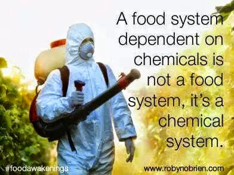

I put a comment (née rant) on Google+ in response to [Tim Osmar](https://plus.google.com/u/0/+TimOsmar/posts) [posting this image](https://plus.google.com/106765418452560766102/posts/a96rUxZcXVX) in the context of [Monsanto](http://www.monsanto.com). My comment is actually on a private repost of the original post so you can't see it unless you .... um ... that it too complicated to work out and why I don't like social media. I can never figure out who can see what.

I realise now that I had quite succinctly captured my thoughts on the organic movement but things seem to disappear off Google+, or at least I can never find them again,  so I thought I'd copy my words here and fix the spelling along the way.

I think that what Monsanto (and what many similar companies) are trying to do in locking in the use of their pesticide with associated genetically modified seed and terminator genes is a terrible thing and should be stopped **BUT** it makes me so sad that the people arguing against them polarize the debate in the other direction and talk about all "chemicals" and their use as bad.

It is kind of like being anti nuclear. Is that anti nuclear weapons? Anti nuclear power? Anti radio therapy?

When you fall over do you refuse an X-ray because you are anti nuclear weapons? No.

Do we go into hospitals and smash-up the radio therapy unit? No. But maybe we do chain ourselves to the fence of the missile silo.

The "organic" movement is all or nothing. Nobody asks whether particular use of a herbicide might be better for the environment - it is all banned.

We (you and I) use pesticides every time we travel by air, land or sea. Think about how we keep the roads, rails, hulls, runways free of weeds? How did we clear the insects out of the last plane you flew in? What about the cockroach infestation at your school?

Think about the processes involved in manufacture of the device you are reading this on and its transport into your hands. Think about the way the raw materials were gathered and processed and transported. All those people. All that infrastructure supporting them. All reliant on pesticides to do things like clean water lines, air-conditioning units, toilets, kitchens and to liberate people from the chores of weeding so they can spend their time contributing to production of iPads and laptops.

There is a quote I learned somewhere at school that said "Most people spent most of their time weeding". To show how far out of touch we are when I search for this on Google today it suggests I might be looking for "wedding" then that I mean marijuana then that I am trying to optimise my time in the office.

The upshot of the whole process is that the Monsantos of this world win. The people who are opposing them seem to be loopy Luddites who are against the modern world. **Instead of being held to account and regulated by reasoned debate they get away with murdering the planet.** Whose fault is that?
