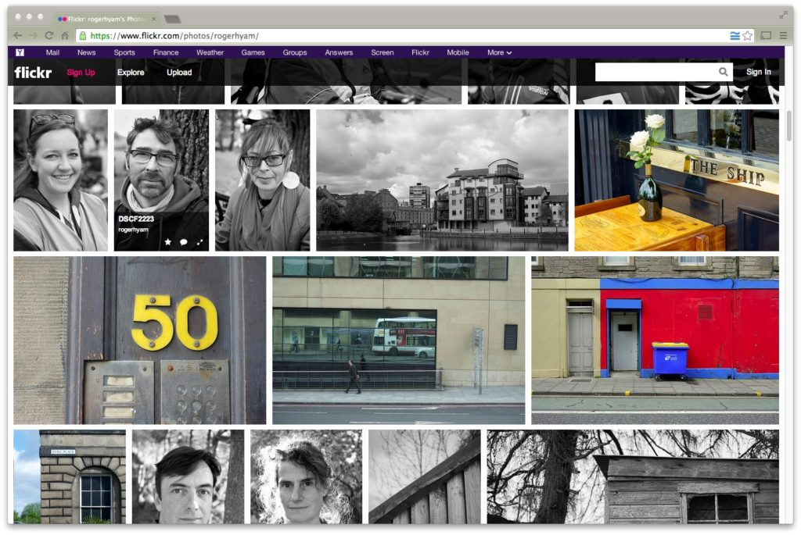
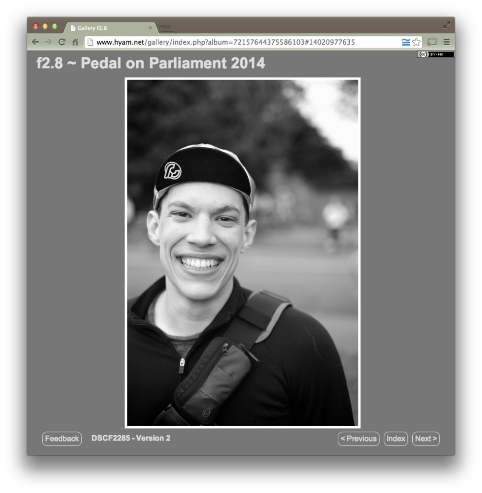
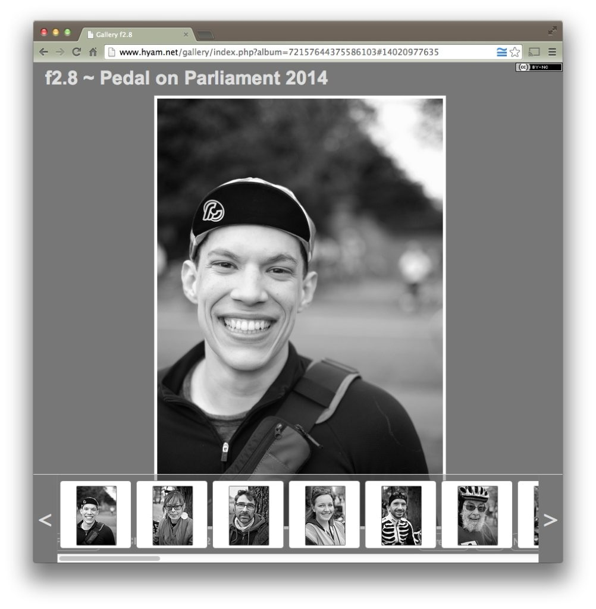
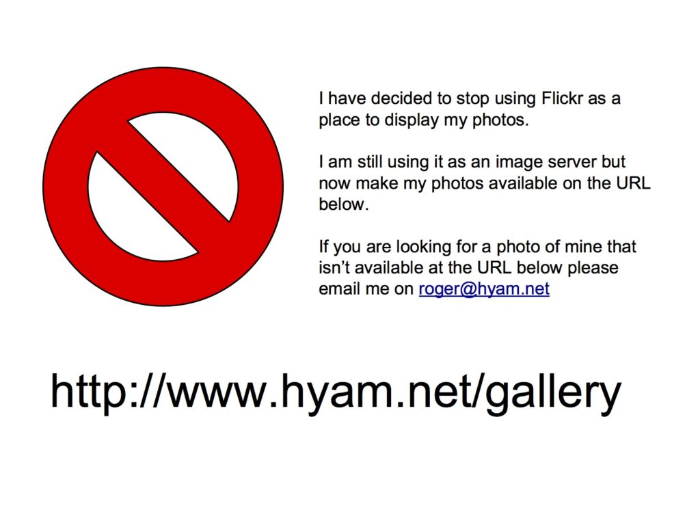

I have been increasingly dissatisfied with the way Flickr displays my photographs. This is linked with my inability to get on well with social media in general, perhaps with the exception of Twitter. Here is a screen shot of what my Flickr page looked like just before I took the hatchet to it.

<!--more-->All the images are mashed together into a wall of uneven size bricks with a white mortar. The landscape format images are displayed twice as large as the portrait format. Any image I want to be public will be included in my photostream with every other image I want seen. I can't restrict them to just being visible within a certain context. Here we see black and white portraits are along sides a colour exercise I did. Even within an album the first thing the viewer sees is a mash up of all the images.

When you click on a photo you don't just see a blow up of that photo you get a display of square-cropped versions of other photos to distract you. If the photo has been added to multiple groups and albums you get it in the context of those as well.

There is little chance of a subtle image working. All images are in competition with other images all the time. They have to work at different scales and auto cropped in different ways. It is about images as marketing fodder not photographs as drawings made with light.

I find the social aspects insidious. I am as vain as the next man (probably much more so as I'm writing a blog) so I get a thrill when someone favourites a photo or the number of views goes up. I find myself adding photos to groups in the hope that someone will see them and say how wonderful they are. But this in not why I want to take photographs.  I want to say what I want to say whether it is popular or not yet I find myself drawn into wondering what would be popular. I may as well go the whole hog and buy a pure white kitten to photograph.

Having said all that **I really do like Flickr as an image server**. It integrates nicely with Apple Aperture I use to manage my photos on the desktop and the API is a useful way to embed images in my blog site. The solution to my woes is to take all my Flickr photos private so that none are publicly visible through the interface and write my own rendering gallery software.

I have pretentiously called my little gallery system f2.8. This is in homage to [Group f/64](http://en.wikipedia.org/wiki/Group_f/64) the San Francisco photographers who included [Andsel Adams](http://en.wikipedia.org/wiki/Ansel_Adams) and also in homage to the probably apocryphal story that the [Observer](http://observer.theguardian.com/) portrait photographer [Jane Bown](http://en.wikipedia.org/wiki/Jane_Bown) used to shoot all her portraits at f2.8. God I am a [pseud](http://en.wikipedia.org/wiki/List_of_regular_mini-sections_in_Private_Eye#Pseuds_Corner).

The interface displays one photograph at a time. Clicking the index button gives a scrollable set of images displayed like old fashioned 35mm slides so that landscape and portrait formats are treated more equally. Clicking on a slide displays the picture and, most importantly, hides the slide tray so you just look at that photo. It took me a day and a bit to implement.

You can visit my new photo gallery at [www.hyam.net/gallery](http://www.hyam.net/gallery).  There will be some broken links around by blog site that need cleaning up but the transition seems to be quite smooth. If you visit [my Flickr page](https://www.flickr.com/photos/rogerhyam/) you will only see a single image - this one.

