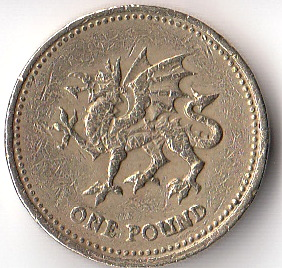

This is by way of a note to self. I'll look back on it as a told-you-so in some form. Maybe with regrets maybe not.

This is why I am voting Yes.

**1) Trident Nuclear Missiles:** I am ideologically opposed to renewing our nuclear weapons system. I don't think it is morally defensible for us to have weapons of mass destruction. If it is OK for us then it must be OK for Iran & Co.

All the main UK parties want to renew our weapons in some form. They claim it doesn't breach the [Nuclear Non-Proliferation Treaty](http://en.wikipedia.org/wiki/Treaty_on_the_Non-Proliferation_of_Nuclear_Weapons) because we would be using the same warheads - thus obeying the letter and not the spirit. Most (all?) of the Yes parties want a nuclear free Scotland. I'm therefore obliged to vote Yes as a matter of conscience.<!--more-->

Watch this Yes Minister clip and then say that spending £4,000,000,000 a year for at least the next 10 years is good value. Alistair Darling did say this in the second TV Debate.

http://youtu.be/IX\_d\_vMKswE

If you are OK with nuclear weapons held by a 'just' country then check out this video of Craig Murray - ex-Foreign Office and now political campaigner - on what UK foreign policy is like.

http://youtu.be/CIQ8VVn8AJA

It comes down to fundamental moral principles - I think Scotland might be a bit better and certainly more accountable.

**2) Proportional Representation:** I like democracy. Unfortunately we don't have representative democracy at Westminster. My Westminster MP, [Ian Murray](http://en.wikipedia.org/wiki/Edinburgh_South_\(UK_Parliament_constituency\)), got just over a third of the vote in our constituency at the 2010 election. By far the majority of people didn't vote for him. There are 650 seats at Westminster. The Green party stood for 310 and got about 1% of the vote but they only got 1 seat (Brighton) and that by geographic luck. If 1% of the people in the UK support the Greens you would think they would get between six and seven seats. And this is in a situation where Green is seen as a wasted vote. In a good PR system more people would vote for them.

Scotland has PR and I want to live in a country where the majority of people (even the 'nutters') have their views represented in parliament and make the big decisions on macro economic policy, wars etc via open discussion. There are 2 Green MSPs which is ~ 1.5% of total 129 MSPs. A similar representation in Westminster would be ten MPs which is about the same as the Northern Irish unionist parties have. None of the Westminster stuff makes sense!

**3) Written Constitution:** The countries of the world that don't have a written constitution are: Israel, Saudi Arabia, New Zealand, the UK and possibly parts of Canada. There are a hundred plus countries that do. I've heard people argue over and over through my life that not having a written constitution is the best way and part of what makes Britain Great. I realise now that they are just British nationalists who would think anything British is best by default. This is the definition of jingoistic.

The actual advantage of a "flexible" non-written constitution is that you can change it whilst no one is looking thus avoiding full democratic debate. His is why reactionary politicians hate the human rights act and similar. The golden rule is that the people with the gold (and their lawyers) make the rules. A written constitution doesn't prevent this but it helps expose it. I want to live in a country with a written constitution.

**4) Anit\-Disestablishmentarianism:** There are 26 [Lords Spiritual](https://www.churchofengland.org/our-views/the-church-in-parliament/bishops-in-the-house-of-lords.aspx) who are bishops of the Church of England who sit in the house or Lords. ~ 3% of the Lords but active members. They often have progressive anti-poverty views so I usually like what they say but they are the result of the privileged position of an established church. Living in Scotland and not being a member of the Church of England I have no formal link to these people at all yet they have power over me. I'd like to live in a secular state filled with thoughtful, religious and humanistic people. (Don't even get me started on the 90+ lords who have power over us by right of their birth.)

**5) Anti-Nationalism:** I don't like nationalism beyond some gentle sporting/cultural rivalry . I neither like British Nationalism nor Scottish Nationalism. There is nationalism on both sides of this debate. It annoys me when journalists talk about "the nationalists". Which ones do they mean? The ones who would keep the UK on principle or the ones who would have an independent Scotland on principle? I think we should be as integrated with other countries as possible. The main route for this is via Europe. The UK is currently (and always has been) having a debate over Europe. It is likely we will have renegotiation and an in/out vote within a few years no matter who wins in Westminster. I want to live in a country that is enthusiastic about Europe. I believe Scotland is naturally more inclined to Europe and would have to be that way because of its size. There may be an interim phase but Scotland would be an active part of Europe. The UK may well leave.

**5) Equality:** I want to live in a more equal society because I buy the thrust of what is said in the [Spirit Level](http://www.equalitytrust.org.uk/). Just by popping London out of the equation an independent Scotland becomes a more equal free standing nation. But generally I believe that Scotland is more egalitarian than the UK as a whole but particularly parts of the SE of England. By the way [Ed Miliband](http://newsnetscotland.com/index.php/scottish-news/5011-miliband-praises-more-equal-small-independent-countries) thinks small, more equal countries are better too - not that he or his party will do anything about it!

**6) We are sunk either way:**  There are big risks in an independent Scotland. It could all go belly up but equally things will not be rosy if we stay in the UK. There will be a [10% cut in public spending in Scotland](http://www.heraldscotland.com/politics/referendum-news/english-say-scots-will-pay-a-heavy-price-for-referendum.25092377) over the next few years on top of the austerity measures planned by the Westminster parties. The UK economy is very unbalanced. All the other major economies grew out or the 2008 crash far quicker. We are totally skewed to financial services and housing bubbles in the South East. There will be another crash. Scotland on its own may be more nimble and able to rebalance its economy before the next big one. This is as much of any argument for being big and able to ride the storm as part of a UK.

**7) I have little choice:** All the people with my values are on the Yes side. The No campaign only talks about money. The only way I can indicate that there are things that are more important than the City of London is to vote Yes.

**FAQ:** **Why don't the English get a vote?** For the same reason the Germans or the Poles wouldn't get a vote on whether the UK should leave the EU.

**FAQ: Currency?** See discussion under "we are sunk either way". If independence happens we will use the the UK pound in some form for a while - perhaps without formal union. It won't be the end of the world. Currency issues are short term issues ~ 10 years-ish. National issues are longer term.

Consider the pound coin in the photo at the top of the page. It is mine. I took it out of my pocket just now. It is actually a Welsh one. If I kept it in my pocket and moved to Germany it would still be my pound. I could buy something from a Swede if he would take it and he could buy something from a Canadian all while standing on a street in Berlin. Anyone can "use the pound". But it isn't that simple you say. The Bank of England sets monetary policy (the interest rate mainly but it also runs the printing presses for [QA](http://en.wikipedia.org/wiki/Quantitative_easing)) and we wouldn't be able to effect  what went on there. We would have to follow what the English did. Well isn't that what happens now? Scotland is "only" 9% of the UK economy and population. The Bank of England therefore should not be taking us too much into account anyway. I suspect the City of London has more influence than anything else.

**FAQ: What about pensions?**  My pension age has gone from 60 to 67 since 1999. That is increased seven years in fourteen years. My pension arrangements seem to change about every two years. There are seventeen years till I retire. That is seven or eight more changes and they won't be for the better! In or out of the UK our pensions are shafted. **N.B.** Neither of my grandfathers nor my father lived passed seventy but I don't reckon there will be a conventional retirement before seventy by the time I get there.
