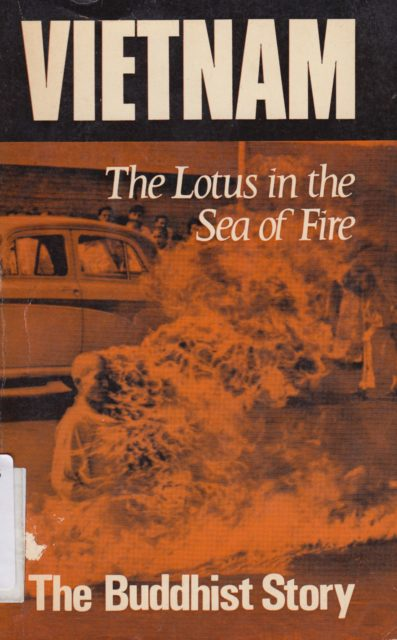

I just read "Vietnam: The Lotus in the Sea of Fire". This small book was written at the height of the Vietnam war by my Zen Buddhist teacher Thich Nhat Hanh.

My first sensation on receiving the book was one of gratitude. I had been wanting to read it for some time but it had never come to hand. It has been out of print for a long time but I found a copy on [Abebooks](http://www.abebooks.co.uk/) for £5 delivered to my door. This copy was an ex-library volume from the [Cathedral and Abbey Church of St Alban](https://www.stalbanscathedral.org/) and is a 1967 first UK edition. It feels like a piece of history. I imagine it being bought 47 years ago by someone trying to understand the situation from a Vietnamese Buddhist perspective. I wonder why it was discarded.

The cover is as powerful as it is iconic. It shows the self-immolation of Buddhist monk Thich Quang-Duc. The book could be seen as an explanation of the context in which Thich Quang-Duc and other Buddhists felt they had to burn themselves.<!--more-->

Vietnam had been at war for much of the 20th century. It had been a French colony, occupied by the Japanese, independent and recolonised and split in half. The American's and the West were fighting the forces of communism coming from the North. The Chinese were fighting capitalism coming from the South. Many Vietnamese felt that the largely Roman Catholic Southern government was a puppet of the West and saw it as a continuation of brutal French colonialism. The communist forces were able to harness this patriotism to gain support of a populous largely ignorant or apathetic to the politics of communism. During this time there was much suppression of Buddhists who had not taken either a communist or ant-communist stance. Thich Nhat Hanh felt that the failure of the Southern governments to engage with the cultural heritage and nationalism was a major failing. It lead to tragedy on many levels. As I write this Thich Nhat Hanh, now 88, is in hospital in France with a brain haemorrhage. He has been living in exile from Vietnam for half a century with only a single return visit. Here is hoping he recovers and continues teaching for a few more years.

Strangely I feel more of a connection from this book to my teacher in hospital than the piece of his calligraphy I have hung on my wall.

Having just gone through the Scottish independence referendum I can only feel gratitude that it was so peaceful and that we were able to have an, albeit a little stilted, debate and vote. It is interesting to reflect that many of those on the nationalist side in our debate also felt stronger socialist leanings than those on the unionist side. The Labour party is Scotland is having something of a crisis at the moment many of its core voters having just voted against it.

Nationalism is often painted as fascistic and right wing because of the terrible things that happened across Europe in the 20th century but I've come to appreciate, helped by this book, that the desire for smaller groupings of people to have self determination is a social/socialist and democratic aspiration.
