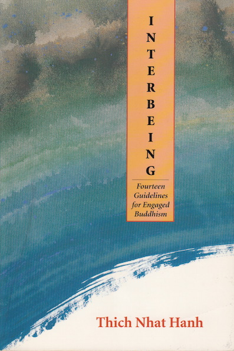

The Order of Interbeing ( [Tiếp](http://en.wiktionary.org/wiki/ti%E1%BA%BFp "wikt:tiếp") [Hiện](http://en.wiktionary.org/wiki/hi%E1%BB%87n "wikt:hiện") ([接](http://en.wiktionary.org/wiki/%E6%8E%A5 "wikt:接")[现)](http://en.wiktionary.org/wiki/%E7%8E%B0 "wikt:现") Order) was founded in the mid 1960's, in Vietnam, by Thich Nhat Hanh (a.k.a. Thay). The basis of the Order are the Fourteen Mindfulness Trainings which lay out the core principles for lay and monastic life. In 1987 Thay published a thin volume in English containing the 14 trainings ~ [Interbeing: Fourteen Guidelines for Engaged Buddhism](http://www.worldcat.org/search?qt=wikipedia&q=isbn%3A0938077597) . I have a 1993 revised edition. The book is required reading for those seeking ordination in the order.

Nothing is fixed. The fourteen trainings are evolving through time. Those in use today are longer and take into account the changing times and sensibilities but retain the core meanings. It is interesting to compare the different version side by side which is what I intend to do here in a [series of interlinked blog posts](http://www.hyam.net/blog/archives/2324 "The Fourteen Mindfulness Trainings").
