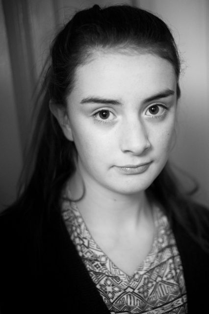

It is a navel gazing time of year but this year I feel more reflective than usual. I'll be 50 in less that two months so perhaps it is my perpetual mid life crisis.

This is a selfie with my [Fujifilm X-M1](http://www.fujifilm.eu/uk/products/digital-cameras/interchangeable-lens-cameras/model/x-m1/) and nifty [XF27mm f2.8](http://www.fujifilm.eu/uk/products/digital-cameras/fujinon-x-mount-lenses/model/fujinon-xf27mmf28/) pancake lens @ f2.8 using the paper ball lampshade as a light source. It successfully diminishes my jowls. Below is my daughter using the same light source but further away. This is with the [XF35mm f1.4](http://www.fujifilm.eu/uk/products/digital-cameras/fujinon-x-mount-lenses/model/fujinon-xf35mmf14-r/) @ f1.4 and an ISO of 2,500 on my [X-Pro 1](http://www.fujifilm.eu/uk/products/digital-cameras/interchangeable-lens-cameras/model/x-pro1/).

 I'm vacillating on whether to breath new life into this blog or kill it completely. I like the idea of keeping a [gratitude journal](http://en.wikipedia.org/wiki/Gratitude_journal) of some kind. Looking at these images I'm grateful for great optics. Those clever people at Fujifilm but also the optics in my eyes and my daughters and all the things that support this seeing.
