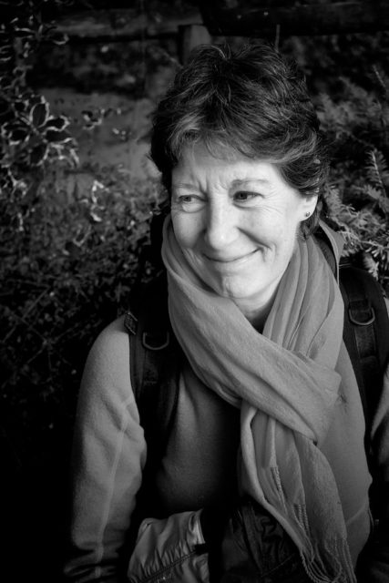

I grabbed this shot of Jane (who is one of my fellow Interbeing aspirants) at the end of our [Wester Caputh](http://www.westercaputh.co.uk/) retreat last week. This is with the FX27mm 'pancake' lens.
