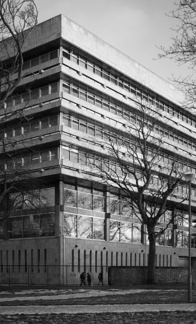

I walk past the Basil Spence building almost every day and have been trying to photograph it for my brother who has an interest in Spence's building. It is actually really hard to get good lighting and view of this building. This is at dawn (about 8:30 am at this time of year) and some of the best I have so far.

