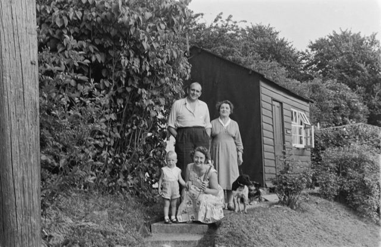

Rearranging my bookshelf I came across the folder with my negatives in and it fell open at a film my father took in the late 1950's. That's my olderest brother, mother and paternal grand parents outside what the Russian's would call a datcha on the Sharpness Canal. The dog in front is Boley. But who is the other dog? This was a good seven years before my birth.

I'm still amazed at the power of the images of people. How will it play out with all the selfies we do now?
