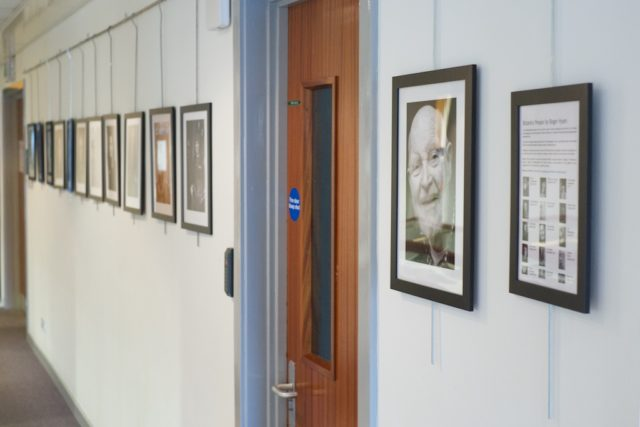
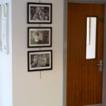

On Monday I noticed that the exhibition cabinets in the foyer of the main science building were empty with a note saying the library (who coordinate the exhibitions) were taking a break before the next exhibit. I thought this was a opportunity for me to exhibit my [Botanics People](http://www.hyam.net/blog/archives/2830 "Botanics People") photos so I showed Leonie the archivist my prints on Tuesday. She liked them but was just about to put historic staff pictures in the cabinets for Friday's annual staff conference. Perhaps I could exhibit them on the walls? But I had no frames!

 After some faffing by Thursday morning I found a way to hang cheap [Ikea Nyttja](http://www.ikea.com/gb/en/catalog/products/00186022/) frames. A trip across town, help from Vlasta to curated forty odd originals down to fifteen then frantic hanging and I had the exhibition in place for nine on Friday morning and the staff conference. It is not ideal. The lighting is rubbish but I have my first portraits exhibition!

So far I have had lots of positive feedback. People have said they look 'fantastic' and other superlatives. Several people have said they have been moved by the shots which I am touched by.

I'm hoping that this will open up the possibility of making more photographic portraits in 2015.
