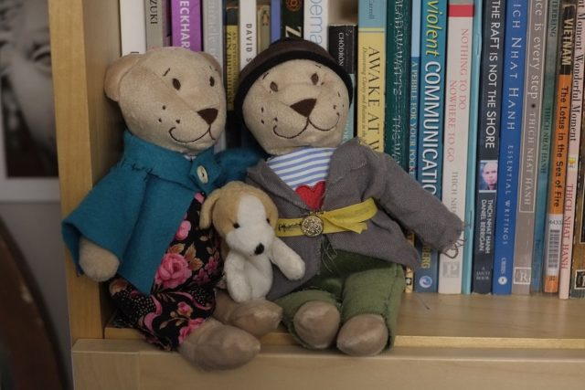

A couple of years ago I bought a £1 bear from Ikea and made him some clothes. Occasionally I like to do this kind thing. It is comforting. He is the bear on the right. I thought he was lonely and bought him a wife. But she was naked for a long time. This year when my daughter asked what I wanted for Christmas I said some clothes for the lady bear. So she made clothes and we now have a couple. They don't have names but they have a dog - I'm not sure where he came from - possibly Ikea as well. They did have a tiny, felt, black cat but she has gone missing. I hope she didn't end up in the bin.

I think of them as a shepherd and his wife. Quite peasant like. If I was better at sewing then they would be POSH bears but I'm not so they will have to stay poor.
