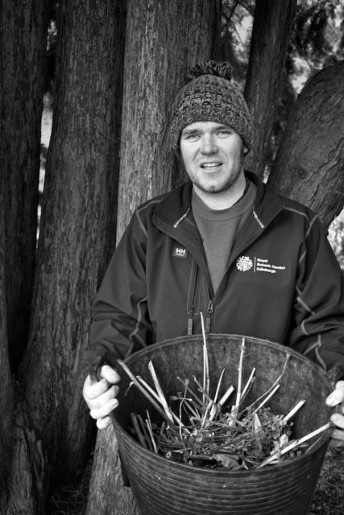

_**

Edinburgh Allotmenteers**_ is my new project for 2015. It builds on my [100 Portraits](http://www.hyam.net/blog/archives/2033 "100 Portrait Photos") project that lead to the [Botanics People](http://www.hyam.net/blog/archives/2885 "First Portrait Exhibition") exhibition.

The goal of the project is to produce a folio of around a dozen A3 prints and possibly a small exhibition. To get to this point I will aim to interact with and photograph as many people as possible across the Edinburgh allotment scene. Hopefully the images can be of use to organisations such as [FEDAGA](http://www.fedaga.org.uk/) and [SAGS](http://www.sags.org.uk/) as well as make a few people smile along the way.

I have been talking with Jenny at the [Edible Gardening Project](http://stories.rbge.org.uk/edible-garden-project)  and hope to work with some of her volunteers as a starting point then move on to allotments around the city as the weather warms up and the light comes back.

Images that I consider successful and posts about my progress will be included here.
