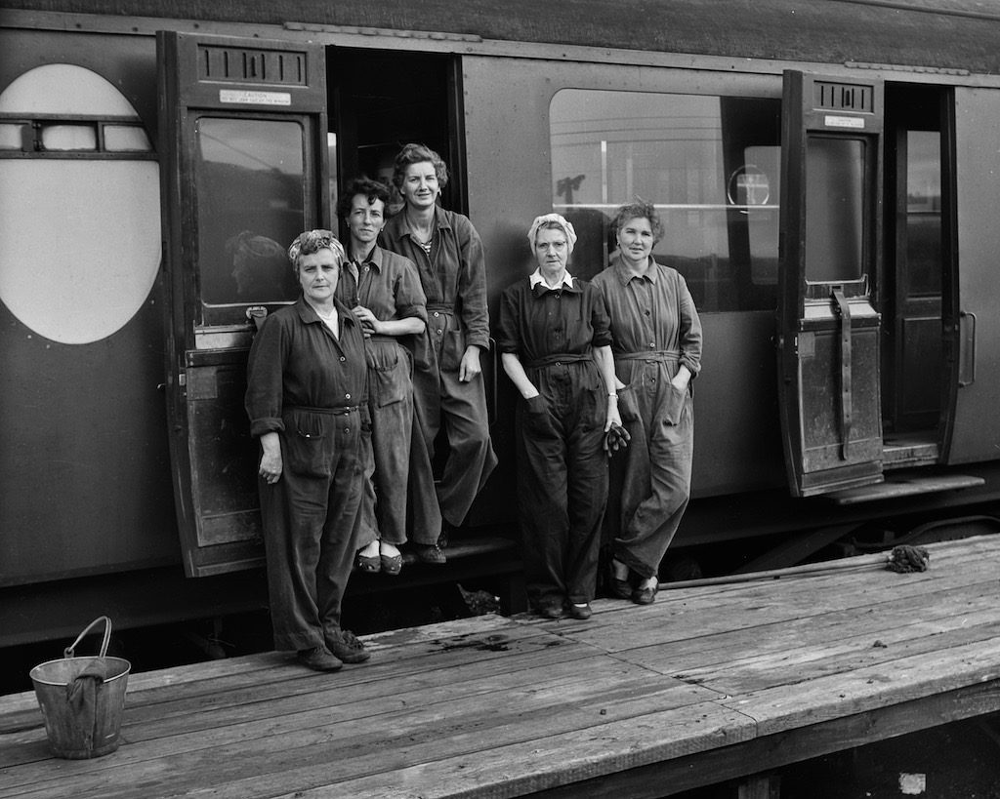
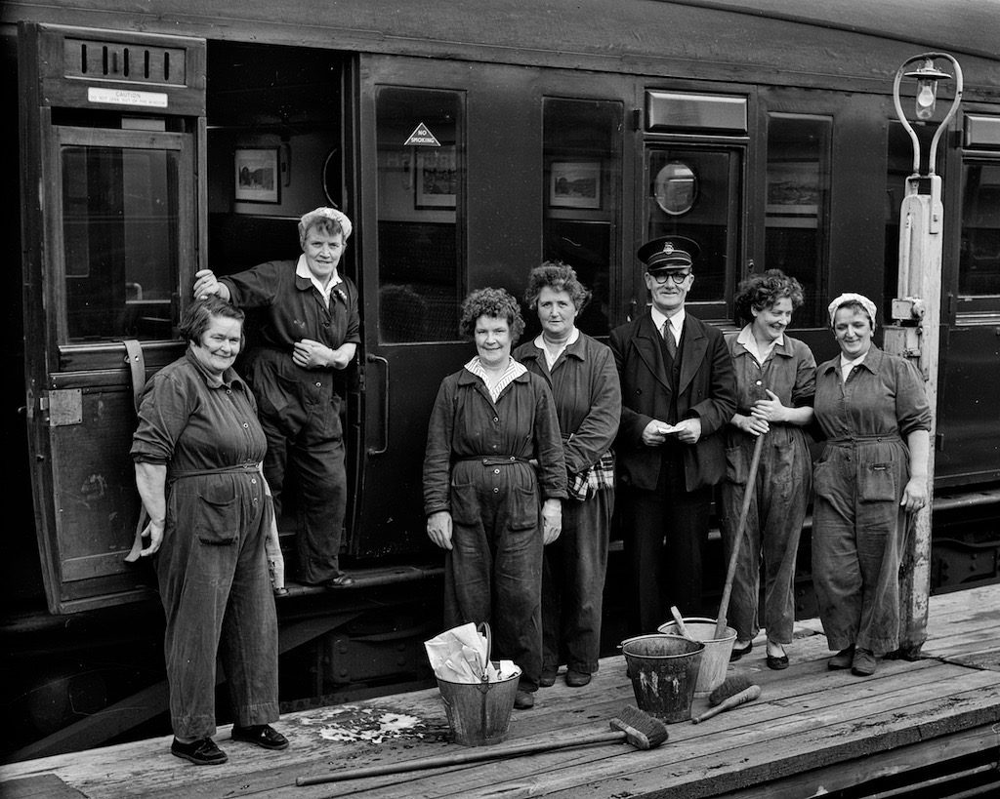
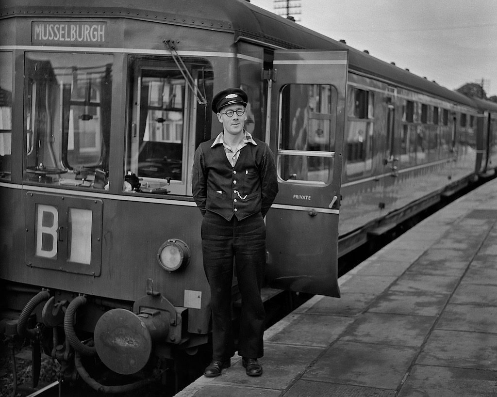
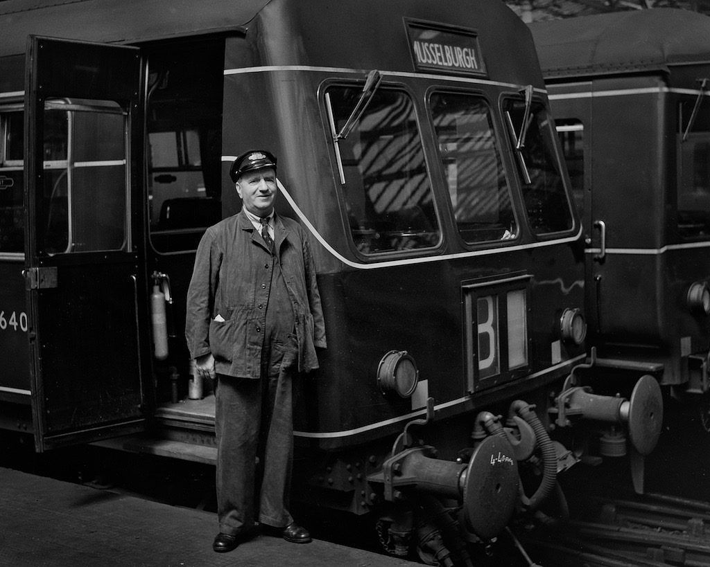
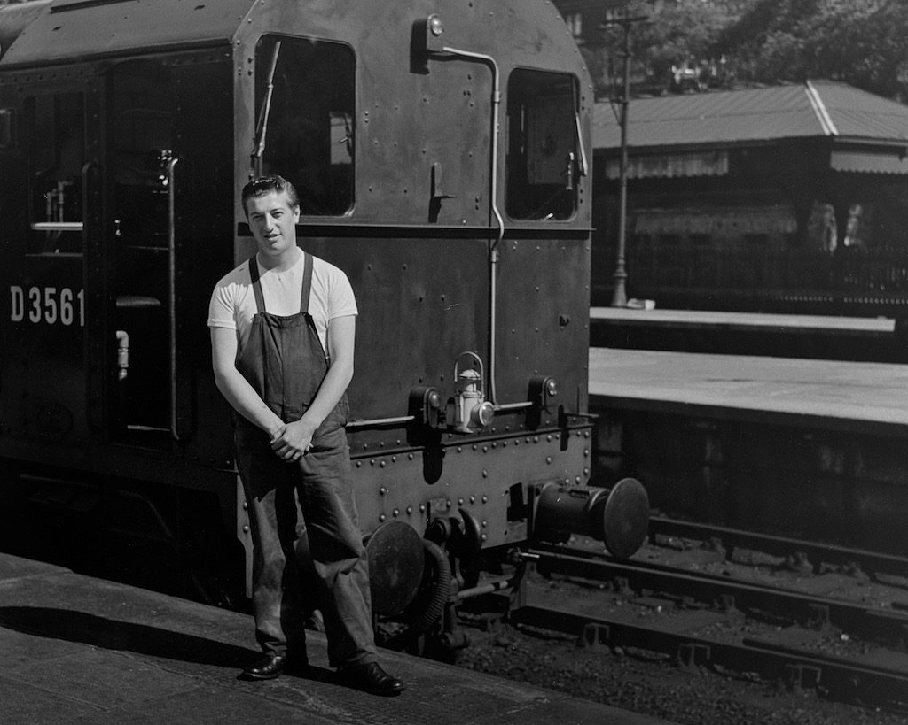
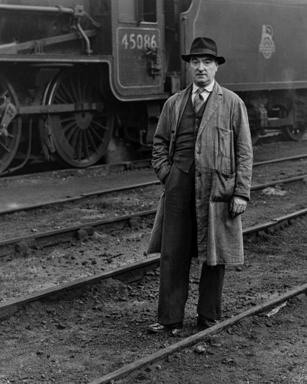

At the end of last year I saw an exhibition of photographs at [Edinburgh Central library](http://www.edinburgh.gov.uk/info/20012/libraries). They were prints from [negatives that had been found in a biscuit tin](http://www.scotsman.com/lifestyle/arts/visual-arts/historic-edinburgh-photos-found-in-biscuit-tin-1-3561138) by historian Archie Foley and put on display with the help of photographer Peter Ross. The photographs had been taken in the 1950s and 1960s by an unknown photographer based in Edinburgh. It is apparent from the subject matter that he was a driver on the railways. Many of the shots are of rail workers in and around Edinburgh.

I was fascinated and left a comment saying I would like to print some of the negatives. I was thinking of my own project on [Botanics People](http://www.hyam.net/blog/archives/2830 "Botanics People") and wondering if I could some how develop a project linked to people working on the railways.

Archie got in touch. We met and he kindly leant me some of the negatives to look through. Below are six that I chose to print.

     

There are some lovely photos amongst the negatives but I was looking for photos where it felt possible to connect with the people and there weren't so many of those.

I don't feel it will be possible to develop this into a project using my own photos just now, unless I can find someone enthusiastic who can give me access to modern rail workers, then it may be worth going through Archie's negatives with a fine tooth comb.

I still feel it has been a worthwhile exercise. It is lovely to see 'normal' (extraordinary) people looking across half a century from locations that are close by but have changed so dramatically.

\[I am not sure of the copyright of these images. If the photographer is identified I believe it will rest with his estate for seventy years after his death. Failing that it resides with Archie. Please respect this and don't reproduce these images without Archie's permission\]
