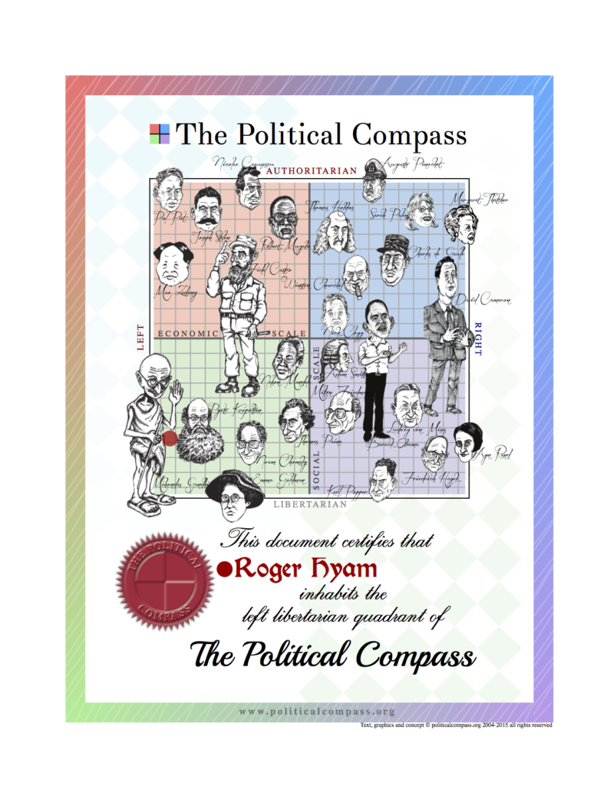
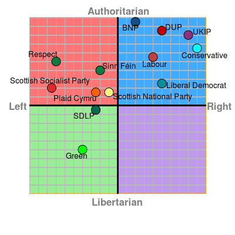

I feel comfortable close to Gandhi. Try the test yourself at the [Political Compass Site](http://politicalcompass.org/). The same site shows just how little choice there is in UK politics at the upcoming general election. The SNP are still left of centre - but only just. Naturally I should be voting Green only.

\[caption id="attachment\_2915" align="aligncenter" width="400"\] Political Compass analysis of UK 2015 General Election parties. Click to visit the site.\[/caption\]
