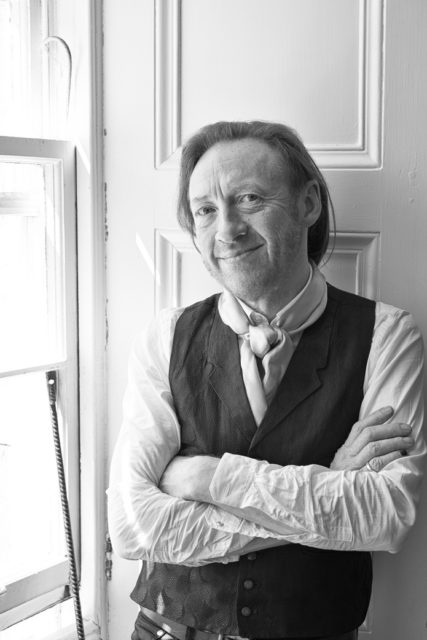

Paul is curator of [Inverleith House](http://www.rbge.org.uk/the-gardens/edinburgh/inverleith-house) gallery at the [Royal Botanic Garden Edinburgh](http://www.rbge.org.uk/) a (surely THE) leading contemporary gallery in Scotland.
