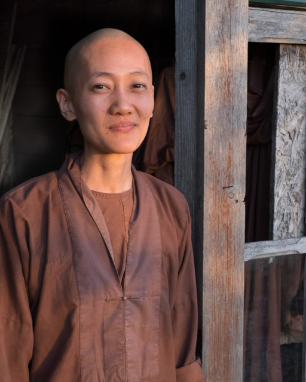

I'm just back from a week at Plum Village. I'd hoped to do some portraiture but didn't really have time. Retreats are busy places what with all the meditating and the Mindfulness.

My working meditation was in the vegetable garden with Sister Coa Nghiem. She is from Thailand and speaks Vietnamese but not much English or French. We worked in the evening as the sun was going down as it was too hot at other times. She laughed a lot. Possibly more than anyone I have ever met so it was a challenge to capture some stillness.
